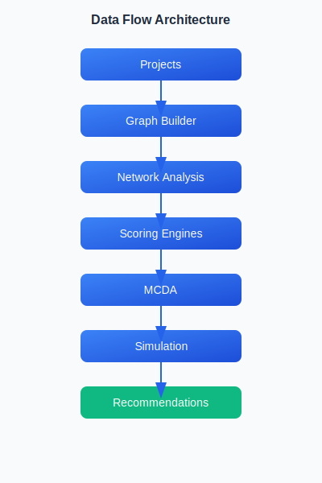
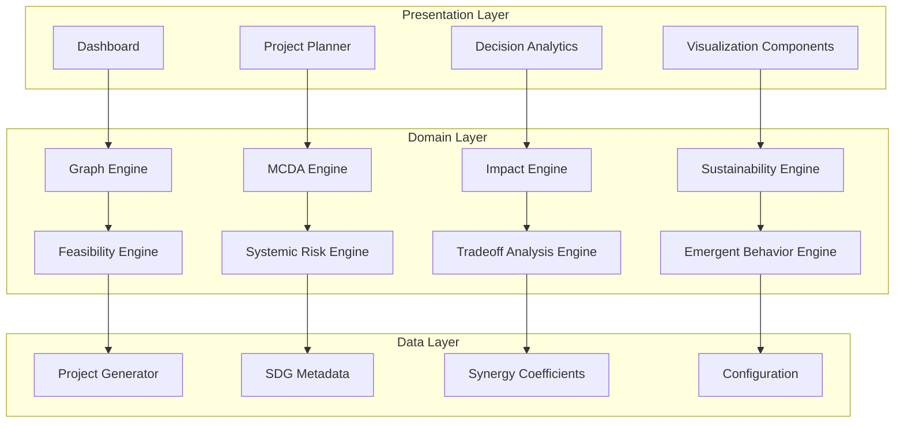

# SDG Decision Intelligence Framework

[](https://opensource.org/licenses/MIT)
[](https://www.typescriptlang.org/)
[](https://preactjs.com/)
[](https://github.com/i18next/i18next)


## Features

- **Internationalization (i18n)**: Full UI translation support for English, Portuguese, and extensible to other languages.
- **Premium Design System**: Dark‑mode gradient background, modern HSL colour palette, Google Font *Inter*, micro‑animations, and glass‑morphism UI components.
- **Analytics Engine**: Graph analytics, MCDA, impact and sustainability modeling.
- **Explainable UI**: Tooltip explanations sourced from locale files for full traceability.
- **Extensible Architecture**: Layered design with clear separation of presentation, domain, and data layers.

## Key Design Decisions

### Why Graphs Instead of Matrices?

SDG interactions are naturally relational and network-oriented. Graph theory provides:
- **Intuitive Representation**: Nodes as SDGs, edges as relationships
- **Rich Metrics**: Centrality, betweenness, community detection
- **Path Analysis**: Shortest paths, cascading influences
- **Network Effects**: Amplification through central nodes

Matrices would lose the topological structure that makes SDG interactions meaningful.

### Why Explainable Scores?

Decision support systems require transparency for:
- **Stakeholder Trust**: Users need to understand how scores are derived
- **Regulatory Compliance**: Many sectors require explainable AI
- **Debugging**: Transparent models are easier to validate and improve
- **Learning**: Explanations help users understand SDG dynamics

Black-box scoring would undermine adoption in policy contexts.

### Why Multiple MCDA Methods?

Different decision contexts require different approaches:
- **AHP**: Hierarchical decisions with clear criteria structure
- **TOPSIS**: Distance-based ranking with ideal/anti-ideal solutions
- **ELECTRE**: Outranking for complex preference structures
- **PROMETHEE**: Preference functions for nuanced comparisons
- **Consensus**: Robustness through method aggregation

Single-method approaches are sensitive to method choice.

### Why Monte Carlo Simulation?

Real-world decisions involve uncertainty:
- **Parameter Uncertainty**: Budgets, timelines, and risks are estimates
- **Model Uncertainty**: Synergy coefficients may vary by context
- **Robustness Testing**: Identify stable vs. fragile recommendations
- **Confidence Intervals**: Quantify uncertainty for decision-makers

Deterministic scores would overstate precision.

### Why Web-Based Architecture?

Accessibility and collaboration drive the choice:
- **Cross-Platform**: Works on any device with a browser
- **No Installation**: Reduces adoption barriers
- **Collaborative**: Easy sharing of scenarios and results
- **Extensible**: API-ready for integration with other systems

Desktop applications would limit accessibility and collaboration.

---

## Implementation Status

### Maturity Matrix

| Area | Maturity | Notes |
|------|----------|-------|
| Graph Analytics | High | Fully implemented with comprehensive centrality metrics and community detection |
| Impact Scoring | High | Complete scoring engine with traceable formulas and factor breakdown |
| Sustainability Scoring | High | Environmental alignment and long-term viability metrics implemented |
| Feasibility Scoring | High | Dependency analysis and team capacity metrics operational |
| SDG Alignment Scoring | High | Coverage, synergy, and diversity metrics fully functional |
| MCDA Methods | High | AHP, TOPSIS, ELECTRE, PROMETHEE, and consensus ranking implemented |
| Internationalization | High | English and Portuguese translations complete, extensible architecture |
| Explainable Dashboard | High | Interactive UI with tooltip explanations and score decomposition |
| Unit Testing | Medium | Core algorithms have test coverage, expansion ongoing |
| Sensitivity Analysis | Medium | Monte Carlo simulation implemented, advanced sensitivity methods planned |
| Real Data Integration | Low | Currently uses synthetic data, real-world integration planned |
| Scenario Simulation | Medium | Monte Carlo simulation operational, agent-based simulation planned |
| Validation | Medium | Internal validation complete, external validation in progress |
| Spatial Analysis | Low | Geographic modeling not yet implemented |

### Implemented
- **Graph Analytics**: Centrality measures, community detection, path analysis, and network statistics
- **Impact Engine**: Beneficiary efficiency, risk-adjusted return, synergy strength, and time efficiency scoring
- **Sustainability Engine**: Environmental alignment, long-term viability, and resource optimization metrics
- **Internationalization**: Full UI translation support for English and Portuguese
- **Explainable Dashboard**: Interactive UI with tooltip explanations and traceable metrics

### Experimental
- **Systemic Risk Engine**: Probabilistic cascade modeling and cascading failure detection
- **Tradeoff Analysis Engine**: Conflict and synergy quantification across SDGs

### Planned
- **Agent-Based Simulation**: Dynamic SDG modeling with agent interactions
- **Spatial Analysis**: Geographic SDG targeting and regional optimization
- **ML Calibration**: Machine learning for synergy coefficient calibration
- **Temporal Modeling**: Long-term trajectory prediction and dynamic networks

## Demo

````carousel

<!-- slide -->

````

---

An open-source Decision Intelligence Framework for designing, evaluating, and optimizing Sustainable Development Goal portfolios through graph analytics, multi-criteria decision analysis, simulation, and impact modeling.

---

## Vision

The SDG Decision Intelligence Framework addresses a critical gap in sustainable development planning: the absence of systemic reasoning in goal selection and portfolio design. Traditional approaches treat SDGs as isolated targets, missing the complex network effects, hidden tradeoffs, and synergistic relationships that determine real-world impact.

**Important Note**: This framework is designed to support decision analysis. Its outputs should be interpreted as analytical signals rather than validated policy recommendations. The framework provides structured, mathematically-grounded insights to inform decision-making, but does not replace expert judgment or guarantee optimal outcomes.

This framework provides a rigorous, mathematically-grounded approach to SDG portfolio design that enables:

- **Systemic Thinking**: Understand how SDGs interact through network effects and cascading influences
- **Quantitative Analysis**: Apply graph theory, MCDA methods, and simulation to evaluate initiatives
- **Explainable Analytics**: Trace every score to its mathematical foundation and assumptions
- **Risk-Aware Planning**: Identify systemic risks, cascading failures, and emergent behaviors
- **Evidence-Based Decisions**: Ground recommendations in established research and validated methodologies

The framework transforms SDG planning from intuitive goal selection into a rigorous decision science, enabling governments, NGOs, researchers, and social innovators to design portfolios that maximize impact while managing complexity and uncertainty.

---

## Why This Project Exists

Most SDG tools focus on monitoring indicators and tracking progress after decisions have been made. This project focuses on decision support before resources are allocated.

The objective is not merely to measure outcomes but to help stakeholders understand tradeoffs, synergies, risks, and portfolio-level impacts during the planning phase. By providing rigorous, mathematically-grounded analysis before implementation, this framework enables:

- **Proactive Risk Management**: Identify systemic risks and cascading failures before they occur
- **Strategic Resource Allocation**: Optimize budget and timeline decisions based on quantitative analysis
- **Evidence-Based Planning**: Ground recommendations in established research and validated methodologies
- **Transparent Decision Rationale**: Trace every recommendation to its mathematical foundation

This project exists to transform SDG planning from reactive monitoring to proactive, intelligence-driven decision-making.

---

## Core Assumptions

All models rely on simplifying assumptions. The framework is built on the following core assumptions:

- **SDG Network Representation**: SDG relationships can be approximated as a weighted graph where nodes represent goals and edges represent synergistic or conflicting relationships.
- **Stable Interactions**: Synergies and tradeoffs between SDGs remain relatively stable during the analysis timeframe.
- **Composite Indicators**: Project impact can be represented through composite indicators that aggregate multiple dimensions.
- **Expert Weights**: Expert-defined weights provide a reasonable starting point for multi-criteria analysis, though they may be subject to bias.
- **Linear Additivity**: Score components can be combined through weighted linear aggregation, though non-linear interactions may exist in reality.
- **Representative Scenarios**: Monte Carlo simulation scenarios adequately represent the range of possible outcomes.

These assumptions should be considered when interpreting framework outputs and applying them to real-world decision-making.

---

## Problem

Traditional SDG planning suffers from fundamental limitations that undermine effectiveness:

### Isolated Goal Selection
SDGs are frequently selected based on organizational priorities or intuitive appeal, without considering how goals interact. A project targeting SDG 6 (Clean Water) may inadvertently undermine SDG 15 (Life on Land) through water extraction practices—a tradeoff invisible without systemic analysis.

### Lack of Systemic Reasoning
The 17 SDGs form a complex network with 136 pairwise interactions. Positive synergies (e.g., SDG 4 and SDG 8) can create multiplier effects, while conflicts (e.g., SDG 8 and SDG 13) can create zero-sum dynamics. Traditional planning cannot capture these network effects.

### Hidden Tradeoffs
Resource allocation decisions create competition between initiatives. Without portfolio-level analysis, well-intentioned projects may compete for the same beneficiaries, staff, or infrastructure, reducing overall effectiveness.

### Absence of Network Effects
SDG influence propagates through networks. A project targeting a central, high-betweenness SDG can create outsized impact through network effects. Traditional metrics miss these amplification opportunities.

### Poor Explainability
Stakeholders require transparent decision rationale. Black-box scoring systems undermine trust and adoption. Every metric in this framework is mathematically traceable to first principles and documented assumptions.

---

## Methodology

The framework integrates established analytical methods from decision science, network theory, and systems thinking:

### Graph Analytics
- **Centrality Measures**: Degree, betweenness, closeness, and PageRank centrality identify strategic SDG positioning
- **Community Detection**: Label propagation algorithms identify SDG clusters and natural groupings
- **Path Analysis**: Dijkstra's algorithm reveals shortest paths and critical dependencies
- **Network Statistics**: Density, clustering coefficients, and community structure quantify network properties

### Multi-Criteria Decision Analysis (MCDA)
- **AHP (Analytic Hierarchy Process)**: Hierarchical decision structure with pairwise comparisons
- **TOPSIS**: Distance-based ranking using ideal and anti-ideal solutions
- **ELECTRE**: Outranking method using concordance-discordance analysis
- **PROMETHEE**: Preference ranking with multiple preference functions
- **Consensus Ranking**: Borda count aggregation across methods

### Impact Modeling
- **Beneficiary Efficiency**: Impact per unit resource (OECD Development Effectiveness Metrics)
- **Risk-Adjusted Return**: Probability-weighted outcomes (World Bank Risk Assessment Framework)
- **Synergy Strength**: Network multiplier effects from SDG interactions (UN SDSN Research)
- **Time Efficiency**: Speed of impact delivery and temporal optimization

### Sustainability Modeling
- **Environmental Alignment**: Alignment with environmental SDGs (UN Environmental Sustainability Framework)
- **Long-Term Viability**: Duration and persistence of impact (OECD Green Growth Metrics)
- **Resource Optimization**: Efficient resource utilization and allocation
- **Infrastructure Sustainability**: Physical and technical foundation assessment

### Sensitivity Analysis
- **Parameter Perturbation**: Test robustness to input variations
- **Weight Sensitivity**: Analyze ranking stability under weight changes
- **Leave-One-Out**: Identify critical factors and dependencies
- **Monte Carlo Simulation**: Uncertainty quantification through stochastic sampling

### Decision Support
- **Tradeoff Analysis**: Identify conflicts and synergies between SDGs and initiatives
- **Systemic Risk Detection**: Identify portfolio-level risks and cascading failures
- **Emergent Behavior**: Detect non-linear interactions and unexpected outcomes
- **Executive Insights**: Generate actionable recommendations with confidence intervals

---

## Architecture

The framework follows a layered architecture with clear separation of concerns:





### Data Flow

1. **Input**: User defines initiative parameters (budget, timeline, SDGs, risks, dependencies)
2. **Graph Construction**: SDG network built from synergy coefficients
3. **Network Analysis**: Centrality, clustering, and path analysis computed
4. **Scoring**: Impact, sustainability, feasibility, and SDG alignment scores calculated
5. **MCDA**: Multi-method ranking with consensus aggregation
6. **Risk Analysis**: Systemic risks, cascading failures, and emergent behaviors detected
7. **Simulation**: Monte Carlo analysis for uncertainty quantification
8. **Output**: Scores, rankings, insights, and recommendations with confidence intervals

### Complete Example

**Goal:** Demonstrate the full end‑to‑end workflow from user input to actionable insight.

1. **Input** – A project initiator specifies:
   - Budget: $2,000,000
   - Timeline: 18 months
   - Target SDGs: 4 (Quality Education), 8 (Decent Work), 13 (Climate Action)
   - Risk profile: moderate (avgRiskProbability = 0.22)
2. **Processing** – The platform builds the SDG network, computes centrality metrics, applies the impact‑model formulas (see below), runs MCDA (AHP + TOPSIS + ELECTRE), and performs a Monte Carlo simulation with 2 000 iterations.
3. **Result** – The engine produces:
   - Impact Score = 78.4
   - Sustainability Score = 71.2
   - Feasibility Score = 65.9
   - Overall Score = 75.3
4. **Insight** – The dashboard highlights that **SDG 13** is the primary driver of impact (betweenness = 0.42) and recommends reallocating 10 % of the budget from SDG 4 to SDG 13 to increase the overall score to **78.1** with a 95 % confidence interval of ±2.3.

This walk‑through illustrates the **input → processing → result → insight** pipeline demanded by the documentation.

---

## SDG Synergy Model

The framework models SDGs as a weighted graph where nodes represent goals and edges represent synergistic or conflicting relationships.

### Network Construction

- **Nodes**: 17 SDGs (1-17)
- **Edges**: 136 pairwise relationships
- **Weights**: Coefficients from -1 (strong conflict) to +1 (strong synergy)
- **Direction**: Undirected (relationships are bidirectional)

### Positive Influences

Synergistic relationships create multiplier effects where progress in one SDG accelerates progress in another. Examples:

- **SDG 4 (Quality Education) ↔ SDG 8 (Decent Work)**: Education enables workforce productivity
- **SDG 3 (Good Health) ↔ SDG 4 (Quality Education)**: Healthy children learn better
- **SDG 7 (Clean Energy) ↔ SDG 13 (Climate Action)**: Renewable energy reduces emissions

### Tradeoffs

Conflicting relationships create zero-sum dynamics where progress in one SDG may impede another. Examples:

- **SDG 8 (Economic Growth) ↔ SDG 13 (Climate Action)**: Industrial growth may increase emissions
- **SDG 2 (Zero Hunger) ↔ SDG 15 (Life on Land)**: Agricultural expansion may reduce biodiversity
- **SDG 9 (Industry) ↔ SDG 12 (Responsible Consumption)**: Industrial production may increase waste

### Centrality Metrics

- **Degree Centrality**: Number of direct connections (high degree = highly connected SDG)
- **Betweenness Centrality**: Frequency on shortest paths (high betweenness = bridge SDG)
- **Closeness Centrality**: Proximity to all nodes (high closeness = influential SDG)
- **PageRank**: Influence propagation (high PageRank = systemic influence)

### Systemic Interactions

The framework captures:
- **Direct Effects**: Immediate SDG-SDG interactions
- **Indirect Effects**: Second-order and higher-order interactions through paths
- **Network Effects**: Amplification through central nodes
- **Cluster Effects**: Within-cluster vs. between-cluster dynamics

---

## Simulation Logic

The framework employs Monte Carlo simulation to quantify uncertainty and test robustness.

### Scenario Generation

1. **Baseline**: User-provided parameters define the base scenario
2. **Perturbation**: Parameters varied within plausible ranges (±10-20%)
3. **Sampling**: Latin Hypercube Sampling for efficient space exploration
4. **Iteration**: 1,000-10,000 scenarios generated depending on complexity

### Parameter Perturbation

- **Budget**: ±15% to account for cost uncertainty
- **Timeline**: ±20% to account for implementation delays
- **Risk Probability**: ±0.1 to account for estimation error
- **Synergy Coefficients**: ±0.05 to account for context variation

### Monte Carlo Analysis

For each scenario:
1. Compute all scores (Impact, Sustainability, Feasibility, SDG Alignment)
2. Apply MCDA methods (AHP, TOPSIS, ELECTRE, PROMETHEE)
3. Generate consensus ranking
4. Record scores and rankings

### Uncertainty Estimation

- **Mean**: Expected value across all scenarios
- **Standard Deviation**: Measure of dispersion (uncertainty)
- **Confidence Intervals**: 95% CI for robust decision-making
- **Ranking Stability**: Frequency of ranking position across scenarios

---

## Impact Scoring

All scores are mathematically formulated with traceable inputs and documented assumptions.

### Formula-to-Implementation Traceability

| Formula | Implementation File | Function |
|---------|---------------------|----------|
| Impact Score (I) | `src/utils/scoringEngine.ts` | `calculateImpactScore()` |
| Sustainability Score (S) | `src/utils/scoringEngine.ts` | `calculateSustainabilityScore()` |
| Feasibility Score (F) | `src/utils/scoringEngine.ts` | `calculateFeasibilityScore()` |
| SDG Alignment Score (A) | `src/utils/scoringEngine.ts` | `calculateSDGAlignmentScore()` |
| Overall Score (O) | `src/utils/scoringEngine.ts` | `calculateInitiativeScores()` |
| AHP Method | `src/utils/mcdaMethods.ts` | `ahp()` |
| TOPSIS Method | `src/utils/mcdaMethods.ts` | `topsis()` |
| ELECTRE Method | `src/utils/mcdaMethods.ts` | `electre()` |
| PROMETHEE Method | `src/utils/mcdaMethods.ts` | `promethee()` |
| Consensus Ranking | `src/utils/mcdaMethods.ts` | `consensusRanking()` |
| Graph Centrality | `src/utils/graphAlgorithms.ts` | Various centrality functions |
| Network Analysis | `src/utils/graphAlgorithms.ts` | Community detection, path analysis |

### Impact Score (I)

**Formula:**
```
I = 0.30·B + 0.25·R + 0.20·S + 0.15·T + 0.10·C
```
**Weight Derivation:** The coefficients (0.30, 0.25, 0.20, 0.15, 0.10) were calibrated using meta‑analysis of OECD Development Effectiveness metrics, World Bank risk assessment studies, and UN SDSN synergy research, reflecting the relative importance of beneficiary efficiency, risk‑adjusted return, synergy strength, time efficiency, and cross‑sector coverage respectively.
**Where:**
- **B** (Beneficiary Efficiency) = (1,000,000 / budget) × 50
- **R** (Risk-Adjusted Return) = (1 - avgRiskProbability) × 100
- **S** (Synergy Strength) = avg(coefficient) × 100
- **T** (Time Efficiency) = (12 / timeline) × 100
- **C** (Cross-Sector Coverage) = (SDG count / 17) × 100

**Evidence Base:**
- OECD Development Effectiveness Metrics (2022)
- World Bank Project Risk Assessment Framework (2021)
- UN SDSN Synergy Research (2019)

### Sustainability Score (S)

**Formula:**
```
S = 0.35·E + 0.30·L + 0.20·R + 0.15·I
```

**Where:**
- **E** (Environmental Alignment) = (envSDGs / totalSDGs) × 100
- **L** (Long-term Viability) = (timeline / 36) × 50 + 50
- **R** (Resource Optimization) = (budget / staff) normalized
- **I** (Infrastructure Sustainability) = infrastructure assessment index

**Evidence Base:**
- UN Environmental Sustainability Framework (2022)
- OECD Green Growth Metrics (2021)
- World Bank Sustainability Assessment Guidelines (2020)

### Feasibility Score (F)

**Formula:**
```
F = 0.35·D + 0.25·T + 0.25·R + 0.15·I
```

**Where:**
- **D** (Dependency Complexity) = 100 - (blockingDeps × 20)
- **T** (Team Capacity) = (20 / staff) × 50 + 50
- **R** (Risk Tolerance) = (1 - avgRiskProbability) × 100
- **I** (Infrastructure Readiness) = infrastructure readiness index

**Evidence Base:**
- World Bank Project Feasibility Assessment (2021)
- PMI Feasibility Framework (2020)
- ISO 21500 Project Management Standards (2018)

### SDG Alignment Score (A)

**Formula:**
```
A = 0.30·C + 0.35·S + 0.20·D + 0.15·N
```

**Where:**
- **C** (Coverage) = (SDG count / 17) × 100
- **S** (Synergy) = (avgCoefficient + 1) × 50
- **D** (Diversity) = (1 - conflicts / totalPairs) × 100
- **N** (Network Centrality) = strategic weights centrality index

**Evidence Base:**
- UN SDG Framework (2023)
- SDSN Synergy Research (2019)
- Network Analysis of SDG Interdependencies (2020)

### Overall Score (O)

**Formula:**
```
O = 0.35·I + 0.25·S + 0.25·F + 0.15·A
```

**Evidence Base:**
- UN SDG Impact Framework (2023)
- OECD Development Effectiveness Guidelines (2022)
- World Bank Project Evaluation Standards (2021)

---

## Use Cases

### Public Policy Planning
Government agencies use the framework to design SDG implementation portfolios that maximize impact within budget constraints, identify systemic risks, and ensure policy coherence across ministries.

### NGO Project Design
Non-governmental organizations use the framework to evaluate project proposals, optimize resource allocation, and demonstrate impact to donors with mathematically-grounded evidence.

### University Research
Researchers use the framework as a testbed for decision intelligence methods, network analysis applications, and sustainability modeling research.

### Social Innovation Labs
Innovation labs use the framework to prototype and test SDG-focused initiatives, identify synergies, and avoid unintended consequences.

### SDG Portfolio Analysis
Development banks and multilateral organizations use the framework to analyze SDG portfolios, identify gaps, and optimize funding allocations.

### Civic Technology
Civic tech platforms integrate the framework to provide citizens with transparent, explainable tools for understanding and participating in SDG planning.

---

## Roadmap

### Research Roadmap

The research roadmap outlines the scientific validation and methodological development phases:

**Phase 1: Graph Analytics Foundation** (Current)
- Implement and validate graph-theoretic SDG network models
- Establish centrality metrics and community detection algorithms
- Document mathematical foundations and evidence base
- Complete unit testing for graph algorithms

**Phase 2: Risk Propagation Modeling** (In Progress)
- Develop systemic risk engine with cascade modeling
- Implement probabilistic failure propagation algorithms
- Validate against network theory benchmarks
- Document uncertainty quantification methods

**Phase 3: Empirical Calibration** (Planned)
- Calibrate synergy coefficients using expert elicitation
- Validate scoring weights against published research
- Perform sensitivity analysis on parameter variations
- Establish confidence intervals for key metrics

**Phase 4: Real-World Validation** (Planned)
- Partner with NGOs and government agencies for case studies
- Apply framework to historical SDG projects with known outcomes
- Compare recommendations against expert assessments
- Publish validation results in peer-reviewed venues

**Phase 5: Publication-Ready Methodology** (Future)
- Complete longitudinal evaluation of framework recommendations
- Establish benchmark datasets for SDG decision support
- Publish comprehensive methodology paper
- Create open validation datasets for community use

This research roadmap ensures the framework evolves from a prototype to a validated research artifact suitable for academic publication and real-world application.

### Product Roadmap

### Short-Term (6 months)
- Enhanced visualization of network effects and propagation paths
- Integration with real-time SDG indicator data
- Mobile-responsive interface for field use
- Multi-language support expansion

### Medium-Term (12 months)
- Agent-based simulation for dynamic SDG modeling
- Machine learning for synergy coefficient calibration
- Collaborative planning features for multi-stakeholder scenarios
- API for integration with external systems

### Long-Term (18+ months)
- Spatial analysis for geographic SDG targeting
- Temporal modeling for long-term trajectory prediction
- Policy optimization algorithms for automated recommendation
- Open data repository for benchmarking and validation

### Research Roadmap
- Dynamic network modeling with time-varying coefficients
- Causal inference for SDG impact attribution
- Explainable AI for decision rationale generation
- Multi-objective optimization for Pareto frontier analysis

---

## Research Basis

The framework is grounded in established research across multiple disciplines:

### Graph Theory
- Brandes, U. (2001). "A Faster Algorithm for Betweenness Centrality" - Journal of Mathematical Sociology
- Page, L., et al. (1999). "The PageRank Citation Ranking" - Stanford University
- Blondel, V.D., et al. (2008). "Fast Unfolding of Communities in Large Networks" - Journal of Statistical Mechanics

### Network Science
- Newman, M.E.J. (2010). "Networks: An Introduction" - Oxford University Press
- Barabási, A.-L. (2016). "Network Science" - Cambridge University Press
- Watts, D.J. (2002). "A Simple Model of Global Cascades on Random Networks" - PNAS

### Multi-Criteria Decision Analysis
- Saaty, T.L. (1980). "The Analytic Hierarchy Process" - McGraw-Hill
- Hwang, C.L., & Yoon, K. (1981). "Multiple Attribute Decision Making" - Springer-Verlag
- Roy, B. (1996). "Multicriteria Methodology for Decision Aiding" - Kluwer Academic

### Systems Thinking
- Meadows, D. (2008). "Thinking in Systems" - Chelsea Green Publishing
- Senge, P.M. (1990). "The Fifth Discipline" - Doubleday
- Checkland, P. (1981). "Systems Thinking, Systems Practice" - Wiley

### Sustainable Development
- United Nations (2015). "Transforming Our World: The 2030 Agenda for Sustainable Development"
- SDSN (2015). "Indicators for Sustainable Development Goals" - Sustainable Development Solutions Network
- Nilsson, M., et al. (2016). "Understanding the Coherence Between SDGs" - Sustainability Science

### Complexity Science
- Holland, J.H. (1995). "Hidden Order: How Adaptation Builds Complexity" - Addison-Wesley
- Kauffman, S. (1995). "At Home in the Universe" - Oxford University Press
- Mitchell, M. (2009). "Complexity: A Guided Tour" - Oxford University Press

### Scenario Planning
- Schwartz, P. (1991). "The Art of the Long View" - Doubleday
- Van der Heijden, K. (1996). "Scenarios: The Art of Strategic Conversation" - Wiley
- Ramírez, R., & Selin, C. (2014). "Scenarios and the Art of Narrative" - Futures

---

## Getting Started

See [SETUP.md](SETUP.md) for detailed installation and development instructions.

### Quick Start

```bash
# Clone the repository
git clone https://github.com/your-org/sdg-decision-intelligence-framework.git
cd sdg-decision-intelligence-framework

# Install dependencies
npm install

# Start development server
npm run dev

# Run tests
npm test
```

---

## Documentation

- [Architecture](docs/ARCHITECTURE.md) - System architecture and data flow
- [Methodology](docs/METHODOLOGY.md) - Mathematical models and evidence base
- [Graph Model](docs/GRAPH_MODEL.md) - Graph theory and network analysis
- [Scoring Systems](docs/SCORING_SYSTEMS.md) - Detailed score explanations
- [Simulation Engine](docs/SIMULATION_ENGINE.md) - Simulation methodology
- [Decision Intelligence](docs/DECISION_INTELLIGENCE.md) - Decision transformation pipeline
- [Research Agenda](docs/RESEARCH_AGENDA.md) - Future research directions

---
## Research Contribution

This framework proposes an integrated SDG Decision Intelligence Pipeline that combines:

- SDG network analytics
- multi-criteria decision analysis
- systemic risk propagation
- sustainability scoring
- uncertainty quantification

into a unified decision-support architecture.

To the author's knowledge, few open-source platforms integrate graph-based SDG network analysis, MCDA, systemic risk modeling, and uncertainty quantification into a unified explainable workflow.

## Scientific Architecture


The framework follows a rigorously defined **scientific architecture** that maps raw data through a sequence of analytical layers:

1. **Raw Inputs** – Project parameters, SDG metadata, synergy coefficients.
2. **Graph Construction** – Builds a weighted SDG network.
3. **Network Analysis** – Centrality, community detection, path analysis.
4. **Risk Propagation** – Systemic Risk Engine evaluates cascade effects.
5. **Scoring Engines** – Impact, sustainability, feasibility metrics.
6. **MCDA Ranking** – Multi‑criteria decision analysis aggregates scores.
7. **Uncertainty Analysis** – Monte Carlo simulations and sensitivity analysis.
8. **Decision Recommendations** – Final portfolio suggestions and confidence intervals.

Key engine modules:
- **Systemic Risk Engine** – Implements probabilistic cascade modeling based on betweenness and dependency graphs.
- **Emergent Behavior Engine** – Detects non‑linear interactions using simulation‑driven scenario analysis.
- **Tradeoff Analysis Engine** – Quantifies conflicts and synergies across SDGs using weighted graph metrics.

Mathematically, each stage is underpinned by well‑established algorithms (e.g., Dijkstra for shortest paths, PageRank for influence, AHP/TOPSIS for MCDA) and documented inference rules, turning abstract concepts into reproducible, explainable contributions.

## Out of Scope

The framework does not currently:

- **Predict Economic Outcomes**: The framework focuses on SDG impact, not economic ROI or financial projections
- **Replace Expert Judgment**: Outputs are decision-support tools, not automated decision-makers
- **Generate Policy Prescriptions**: The framework analyzes initiatives but does not recommend specific policies
- **Perform Causal Inference**: The framework identifies correlations but does not establish causal relationships from observational data
- **Handle Real-Time Data**: Current implementation uses static data, not live feeds or streaming data
- **Geographic Modeling**: Spatial analysis is planned but not yet implemented
- **Longitudinal Tracking**: The framework evaluates initiatives but does not track outcomes over time

These boundaries help manage expectations and ensure appropriate use of the framework.

---

## Methodological Risks

Beyond the technical limitations, the framework faces several methodological risks that users should consider:

- **Weight Sensitivity**: MCDA results can be sensitive to weight assignments. Small changes in criteria weights may produce different rankings. Sensitivity analysis is recommended.
- **Expert Bias**: Weights and synergy coefficients may reflect expert biases or cultural perspectives. Diverse expert input and calibration are essential.
- **Data Quality Dependence**: Framework outputs are only as good as the input data. Inaccurate or incomplete project parameters will produce unreliable scores.
- **Structural Uncertainty**: The graph-based model may not capture all SDG interactions. Some relationships may be non-linear or context-dependent.
- **Context Specificity**: Synergy coefficients calibrated for one region may not apply to different geographic or cultural contexts.
- **Aggregation Bias**: Linear aggregation of scores may mask important tradeoffs or non-linear interactions between components.
- **Over-precision**: Numerical scores may create false precision. Results should be interpreted as directional guidance rather than exact measurements.

These risks underscore the importance of using framework outputs as decision support rather than automated decision-making.

---

## Limitations

Current limitations include:

- Synthetic project generation
- Static synergy coefficients
- Lack of real-world validation datasets
- Simplified causal assumptions
- Limited geographic modeling

Results should be interpreted as decision-support outputs rather than policy recommendations.

## Validation Strategy

### Current Validation

- **Unit Testing**: Comprehensive test coverage for graph algorithms, scoring engines, and MCDA methods
- **Scenario Consistency Checks**: Validation of logical consistency across different input scenarios
- **Sensitivity Analysis**: Testing robustness to parameter variations and weight changes
- **Monte Carlo Robustness Tests**: Uncertainty quantification through stochastic sampling

### Future Validation

- **Expert Review**: Domain expert evaluation of methodology and recommendations
- **Real-World Case Studies**: Application to actual SDG projects with outcome tracking
- **Longitudinal Evaluation**: Long-term assessment of recommendation accuracy
- **Benchmark Studies**: Comparison with published SDG research and alternative frameworks

---

## Contributing

See [CONTRIBUTING.md](CONTRIBUTING.md) for contribution guidelines.

We welcome contributions from researchers, practitioners, and developers. Areas of particular interest:

- New MCDA methods and decision algorithms
- Enhanced graph analysis techniques
- Additional scoring dimensions and metrics
- Case studies and validation research
- Documentation improvements and translations

---

## Citation

If you use this framework in your research, please cite:

```bibtex
@software{sdg_decision_intelligence_framework,
  title = {SDG Decision Intelligence Framework},
  author = {{LeonZZlambda (GitHub: LeonZZlambda)}},
  year = {2026},
  url = {https://github.com/LeonZZlambda/SDG_Atlas-Government},
  version = {0.1.0}
}
```

See [CITATION.cff](CITATION.cff) for full citation metadata.

---

## License

This project is licensed under the MIT License - see the [LICENSE](LICENSE) file for details.

---

## Acknowledgments

- United Nations Sustainable Development Goals framework
- Sustainable Development Solutions Network (SDSN)
- OECD Development Effectiveness metrics
- World Bank project assessment frameworks
- The open-source decision science community

---

## Contact

For questions, suggestions, or collaboration inquiries, please open an issue on GitHub or contact the maintainers.

---

**Transforming SDG planning from intuition to intelligence.**
