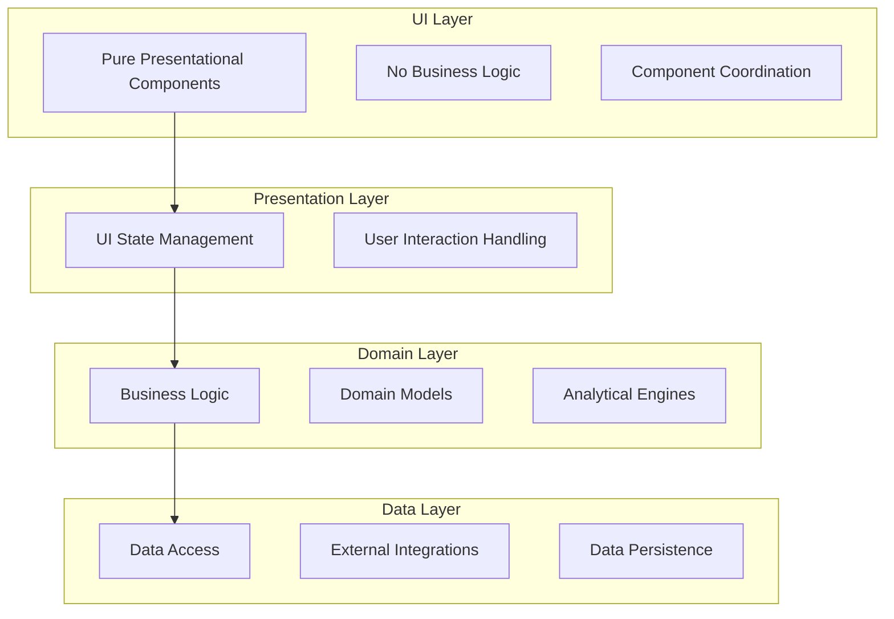
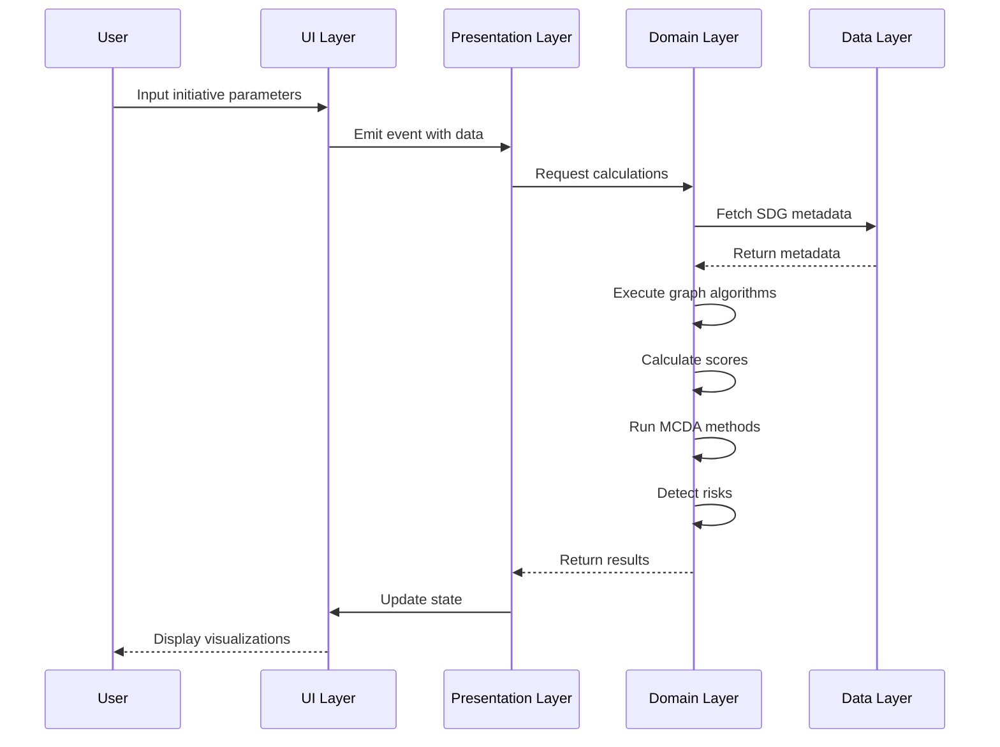
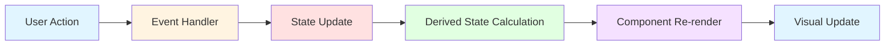
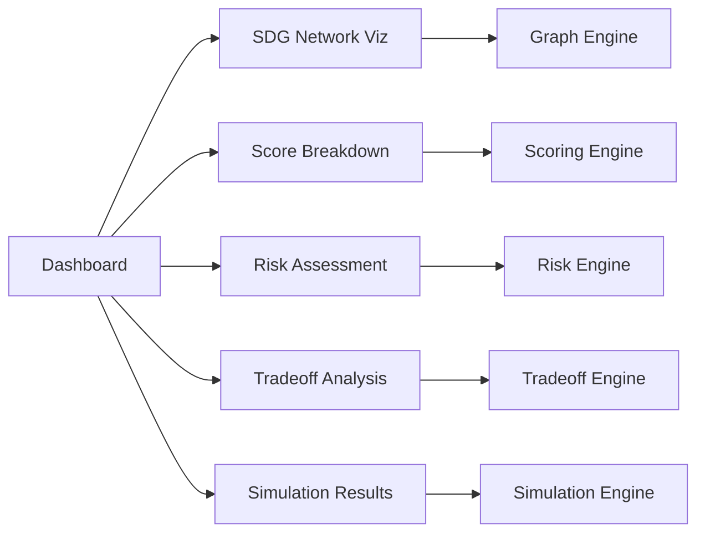
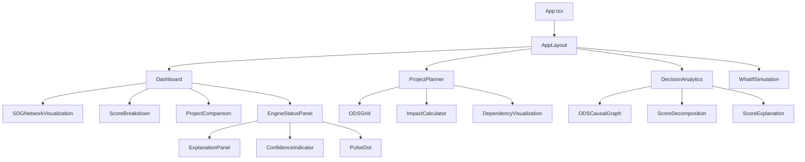
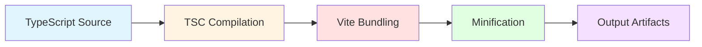

# System Architecture

This document provides a comprehensive technical overview of the SDG Decision Intelligence Framework architecture, including system design, data flow, engine responsibilities, and implementation details.

---

## Table of Contents

1. [System Overview](#system-overview)
2. [Architectural Principles](#architectural-principles)
3. [Layered Architecture](#layered-architecture)
4. [Data Flow](#data-flow)
5. [Engine Responsibilities](#engine-responsibilities)
6. [Component Architecture](#component-architecture)
7. [State Management](#state-management)
8. [Performance Considerations](#performance-considerations)
9. [Extensibility Points](#extensibility-points)

---

## System Overview

The SDG Decision Intelligence Framework is a web-based decision support system built with TypeScript and Preact, implementing a layered architecture that separates concerns across presentation, domain logic, and data access layers.

### Technology Stack

- **Frontend Framework**: Preact 10.29.1 (React-like, lightweight)
- **Language**: TypeScript 6.0.2 (strict type safety)
- **Build Tool**: Vite 8.0.12 (fast development server and bundler)
- **State Management**: Zustand 5.0.14 (lightweight state management)
- **Internationalization**: i18next 26.3.1 (multi-language support)
- **Testing**: Vitest 4.1.9 (unit and integration testing)
- **Animation**: Framer Motion 12.40.0 (smooth transitions)

### Design Philosophy

The architecture follows these core principles:

1. **Separation of Concerns**: Clear boundaries between UI, business logic, and data access
2. **Testability**: Pure functions and dependency injection enable comprehensive testing
3. **Type Safety**: TypeScript interfaces ensure compile-time correctness
4. **Performance**: Efficient algorithms and memoization minimize computational overhead
5. **Extensibility**: Plugin-based architecture allows adding new engines and methods

---

## Architectural Principles

### 1. Layered Architecture

The system is organized into four distinct layers:



### 2. Functional Programming

Core analytical engines use pure functions:
- Deterministic outputs for given inputs
- No side effects
- Easy to test and reason about
- Enable memoization and caching

### 3. Dependency Injection

Services receive dependencies through constructors:
- Enables testing with mock dependencies
- Facilitates swapping implementations
- Improves code modularity

### 4. Type-Driven Development

TypeScript interfaces define contracts:
- Compile-time error detection
- Self-documenting code
- IDE autocomplete support
- Refactoring safety

---

## Layered Architecture

### UI Layer

**Purpose**: Purely presentational components with no business logic.

**Responsibilities**:
- Render data received via props
- Emit events via callbacks
- Manage only local UI state (e.g., expanded/collapsed)
- No side effects or business logic

**Components**:
- `ODSCard` - SDG card display
- `ScoreBreakdown` - Score visualization
- `Toast` - Notification display
- `TabSkeleton` - Loading state placeholder

**Example**:
```typescript
interface ODSCardProps {
  sdgId: number;
  selected: boolean;
  onSelect: (sdgId: number) => void;
}

function ODSCard({ sdgId, selected, onSelect }: ODSCardProps) {
  return (
    <div 
      className={selected ? 'selected' : ''}
      onClick={() => onSelect(sdgId)}
    >
      {/* Pure presentation */}
    </div>
  );
}
```

### Presentation Layer

**Purpose**: Components that handle UI state and user interactions.

**Responsibilities**:
- Manage local UI state (modals, expanded sections, etc.)
- Coordinate between UI components
- Delegate business logic to domain layer
- Handle user interactions and events

**Components**:
- `ODSGrid` - SDG selection grid with state management
- `ProjectPlanner` - Form state and input handling
- `Dashboard` - Data visualization coordination
- `DecisionAnalytics` - Analytics panel coordination

**Example**:
```typescript
function ODSGrid() {
  const [selectedSDGs, setSelectedSDGs] = useState<number[]>([]);
  const { calculateScores } = useScoringEngine(); // Domain layer
  
  const handleSelect = (sdgId: number) => {
    const newSelection = [...selectedSDGs, sdgId];
    setSelectedSDGs(newSelection);
    const scores = calculateScores(newSelection); // Delegate to domain
  };
  
  return (
    <div>
      {sdgs.map(sdg => (
        <ODSCard 
          sdgId={sdg.id} 
          selected={selectedSDGs.includes(sdg.id)}
          onSelect={handleSelect}
        />
      ))}
    </div>
  );
}
```

### Domain Layer

**Purpose**: Business logic and domain models.

**Responsibilities**:
- Implement analytical engines
- Define domain-specific types and interfaces
- Enforce business rules and validations
- Perform data transformations

**Services**:
- `scoringEngine` - Impact, sustainability, feasibility calculations
- `graphAlgorithms` - Network analysis and centrality measures
- `mcdaMethods` - Multi-criteria decision analysis
- `systemicRisk` - Risk detection and cascade analysis
- `tradeoffAnalysis` - Conflict and synergy analysis
- `emergentBehavior` - Non-linear interaction detection

**Example**:
```typescript
export function calculateImpactScore(initiative: Initiative): ScoreBreakdown {
  const budgetEfficiency = initiative.estimatedBudget > 0 
    ? Math.min(100, (1000000 / initiative.estimatedBudget) * 50) 
    : 0;
  
  const riskAdjustedReturn = (1 - avgRiskProbability) * 100;
  
  // Pure function - no side effects
  return {
    metric: 'Impact',
    score: weightedScore,
    factors: [budgetEfficiency, riskAdjustedReturn, ...]
  };
}
```

### Data Layer

**Purpose**: Data access and external integrations.

**Responsibilities**:
- Generate project data and scenarios
- Manage internationalization data
- Handle local storage operations
- Provide data fetching and caching

**Services**:
- `projectGenerator` - Synthetic data generation for testing
- `i18n` - Translation and localization
- `sdgMetadata` - SDG reference data

**Example**:
```typescript
export function generateProject(params: ProjectParams): GeneratedProjectData {
  const connections = generateSDGConnections(params.sdgIds);
  const scores = calculateAllScores(params);
  
  return {
    connections,
    scores,
    metadata: params
  };
}
```

---

## Data Flow

### High-Level Data Flow



### Detailed Data Flow: Initiative Scoring

1. **Input Phase**
   ```
   User Input → Presentation Layer
   - Budget, timeline, staff
   - Selected SDGs
   - Risks and dependencies
   ```

2. **Data Retrieval**
   ```
   Domain Layer → Data Layer
   - SDG synergy coefficients
   - SDG metadata
   - Reference data
   ```

3. **Graph Construction**
   ```
   Domain Layer: Graph Engine
   - Build SDG network graph
   - Nodes: 17 SDGs
   - Edges: 136 pairwise relationships
   - Weights: Synergy coefficients [-1, +1]
   ```

4. **Network Analysis**
   ```
   Domain Layer: Graph Algorithms
   - Calculate degree centrality
   - Calculate betweenness centrality (Brandes' algorithm)
   - Calculate PageRank (iterative)
   - Detect communities (label propagation)
   - Calculate clustering coefficients
   ```

5. **Scoring Phase**
   ```
   Domain Layer: Scoring Engine
   - Calculate Impact Score
   - Calculate Sustainability Score
   - Calculate Feasibility Score
   - Calculate SDG Alignment Score
   - Compute Overall Score
   ```

6. **MCDA Phase**
   ```
   Domain Layer: MCDA Engine
   - Run AHP (Analytic Hierarchy Process)
   - Run TOPSIS (Technique for Order Preference)
   - Run ELECTRE (Elimination and Choice)
   - Run PROMETHEE (Preference Ranking)
   - Compute consensus ranking (Borda count)
   ```

7. **Risk Analysis**
   ```
   Domain Layer: Risk Engine
   - Detect systemic risks
   - Identify cascading failures
   - Analyze risk clusters
   - Generate mitigation strategies
   ```

8. **Tradeoff Analysis**
   ```
   Domain Layer: Tradeoff Engine
   - Identify SDG conflicts
   - Identify SDG synergies
   - Calculate net synergy
   - Generate recommendations
   ```

9. **Simulation Phase**
   ```
   Domain Layer: Simulation Engine
   - Generate scenarios (Monte Carlo)
   - Perturb parameters
   - Compute score distributions
   - Calculate confidence intervals
   ```

10. **Output Phase**
    ```
    Domain Layer → Presentation Layer
    - Scores with breakdowns
    - Rankings with confidence
    - Risk assessments
    - Tradeoff analysis
    - Recommendations
    ```

### State Management Flow



**Zustand Store Structure**:
```typescript
interface PlatformState {
  // Project data
  project: GeneratedProjectData | null;
  
  // UI state
  selectedTab: string;
  showExplanation: boolean;
  
  // Actions
  setProject: (project: GeneratedProjectData) => void;
  setSelectedTab: (tab: string) => void;
  toggleExplanation: () => void;
}
```

---

## Engine Responsibilities

### Graph Engine

**Location**: `src/utils/graphAlgorithms.ts`

**Purpose**: Analyze SDG network structure and identify strategic positioning.

**Inputs**:
- Graph structure (nodes, edges, weights)
- SDG selection (subset of 17 goals)

**Outputs**:
- Degree centrality scores
- Betweenness centrality scores
- Closeness centrality scores
- PageRank scores
- Clustering coefficients
- Community assignments

**Algorithms**:

1. **Degree Centrality**
   - Formula: `C_D(v) = deg(v) / (n-1)`
   - Complexity: O(|V| + |E|)
   - Purpose: Identify highly connected SDGs

2. **Betweenness Centrality** (Brandes' Algorithm)
   - Formula: `C_B(v) = Σ(s≠v≠t) σ_st(v) / σ_st`
   - Complexity: O(|V||E|) for unweighted, O(|V||E| + |V|²log|V|) for weighted
   - Purpose: Identify bridge SDGs that connect network segments

3. **Closeness Centrality**
   - Formula: `C_C(v) = (n-1) / Σ_u d(v,u)`
   - Complexity: O(|V|(|V|log|V| + |E|)) using Dijkstra
   - Purpose: Identify SDGs with short paths to all others

4. **PageRank**
   - Formula: `PR(v) = (1-d)/n + d Σ_u PR(u)/L(u)`
   - Complexity: O(k|E|) where k is iterations (default 100)
   - Purpose: Identify influential SDGs through propagation

5. **Community Detection** (Label Propagation)
   - Algorithm: Iterative label updates based on neighbor majority
   - Complexity: O(k|E|) where k is iterations (max 100)
   - Purpose: Identify SDG clusters and natural groupings

6. **Clustering Coefficient**
   - Formula: `C(v) = 2T(v) / (deg(v)(deg(v)-1))`
   - Complexity: O(|V|³) in worst case, typically O(|V|⟨k⟩²)
   - Purpose: Measure local connectivity and transitivity

**Assumptions**:
- SDG network is static (coefficients don't change over time)
- Relationships are symmetric (undirected graph)
- Edge weights represent strength of interaction

**Limitations**:
- Does not account for temporal dynamics
- Assumes uniform influence propagation
- May not capture context-specific variations

---

### MCDA Engine

**Location**: `src/utils/mcdaMethods.ts`

**Purpose**: Apply multi-criteria decision analysis methods for initiative ranking.

**Inputs**:
- Alternatives (initiatives with criteria scores)
- Criteria (impact, sustainability, feasibility, SDG alignment)
- Weights (relative importance of each criterion)
- Preference thresholds (for ELECTRE and PROMETHEE)

**Outputs**:
- Rankings for each method
- Scores for each alternative
- Consensus ranking across methods
- Sensitivity analysis results

**Algorithms**:

1. **AHP (Analytic Hierarchy Process)**
   - Method: Hierarchical pairwise comparisons
   - Weight calculation: Eigenvector method
   - Complexity: O(m³) where m is number of criteria
   - Purpose: Structured hierarchical decision-making

2. **TOPSIS (Technique for Order Preference by Similarity to Ideal Solution)**
   - Method: Distance-based ranking
   - Distance metric: Euclidean distance
   - Complexity: O(mn) where m is alternatives, n is criteria
   - Purpose: Rank by closeness to ideal solution

3. **ELECTRE (Elimination and Choice Translating Reality)**
   - Method: Outranking relations
   - Concordance threshold: 0.7 (default)
   - Discordance threshold: 0.3 (default)
   - Complexity: O(m²n) where m is alternatives, n is criteria
   - Purpose: Handle partial preference information

4. **PROMETHEE (Preference Ranking Organization Method)**
   - Method: Preference functions with flows
   - Preference type: Linear (default)
   - Complexity: O(m²n) where m is alternatives, n is criteria
   - Purpose: Handle preference intensity

5. **Consensus Ranking**
   - Method: Borda count aggregation
   - Complexity: O(mk) where m is alternatives, k is methods
   - Purpose: Combine multiple method rankings

**Weighting Strategy**:
- Default weights: Impact (0.35), Sustainability (0.25), Feasibility (0.25), SDG Alignment (0.15)
- Derived from UN SDG framework priorities
- Adjustable for context-specific requirements

**Assumptions**:
- Criteria are independent (no double-counting)
- Preferences are transitive
- Weights reflect true decision-maker priorities

**Limitations**:
- Sensitive to weight selection
- May produce different rankings across methods
- Requires expert judgment for weight calibration

---

### Impact Engine

**Location**: `src/utils/scoringEngine.ts`

**Purpose**: Calculate impact potential of initiatives based on efficiency, risk, synergy, and coverage.

**Inputs**:
- Initiative parameters (budget, timeline, beneficiaries, SDGs)
- Risk assessments (probability, impact)
- SDG synergy coefficients

**Outputs**:
- Impact score (0-100)
- Score breakdown with factors
- Factor-level interpretations
- Contribution to overall score

**Scoring Logic**:

```
Impact Score = 0.30·Budget Efficiency + 0.25·Risk-Adjusted Return + 
               0.20·Synergy Strength + 0.15·Time Efficiency + 
               0.10·Cross-Sector Coverage
```

**Factor Calculations**:

1. **Budget Efficiency**
   - Formula: `B = min(100, (1,000,000 / budget) × 50)`
   - Rationale: More beneficiaries per dollar = higher efficiency
   - Evidence: OECD Development Effectiveness Metrics

2. **Risk-Adjusted Return**
   - Formula: `R = (1 - avgRiskProbability) × 100`
   - Rationale: Lower risk = higher expected return
   - Evidence: World Bank Risk Assessment Framework

3. **Synergy Strength**
   - Formula: `S = avg(coefficient) × 100`
   - Rationale: Strong synergies create multiplier effects
   - Evidence: UN SDSN Synergy Research

4. **Time Efficiency**
   - Formula: `T = min(100, (12 / timeline) × 100)`
   - Rationale: Faster delivery = quicker impact
   - Evidence: Project management best practices

5. **Cross-Sector Coverage**
   - Formula: `C = (SDG count / 17) × 100`
   - Rationale: Broader coverage = systemic impact
   - Evidence: UN SDG Framework

**Assumptions**:
- Budget estimates are realistic
- Risk probabilities are accurate
- Synergy coefficients apply to context
- Timeline is achievable

**Limitations**:
- Linear relationships may not capture non-linear effects
- Does not account for implementation quality
- Assumes uniform beneficiary impact

---

### Sustainability Engine

**Location**: `src/utils/scoringEngine.ts`

**Purpose**: Assess long-term viability and environmental alignment of initiatives.

**Inputs**:
- Initiative parameters (timeline, staff, infrastructure)
- SDG selection (environmental goals)
- Resource allocation data

**Outputs**:
- Sustainability score (0-100)
- Score breakdown with factors
- Factor-level interpretations
- Contribution to overall score

**Scoring Logic**:

```
Sustainability Score = 0.35·Environmental Alignment + 0.30·Long-term Viability + 
                      0.20·Resource Optimization + 0.15·Infrastructure Sustainability
```

**Factor Calculations**:

1. **Environmental Alignment**
   - Formula: `E = (envSDGs / totalSDGs) × 100`
   - Environmental SDGs: 6, 7, 11, 12, 13, 14, 15
   - Rationale: Environmental goals support long-term sustainability
   - Evidence: UN Environmental Sustainability Framework

2. **Long-term Viability**
   - Formula: `L = min(100, (timeline / 36) × 50 + 50)`
   - Rationale: Longer initiatives have more lasting impact
   - Evidence: OECD Green Growth Metrics

3. **Resource Optimization**
   - Formula: `R = min(100, (budget / staff) / 10,000 × 100)`
   - Rationale: Efficient resource use enables sustainability
   - Evidence: World Bank Sustainability Assessment

4. **Infrastructure Sustainability**
   - Formula: `I = infrastructure assessment index (50-70)`
   - Rationale: Physical infrastructure supports persistence
   - Evidence: Infrastructure sustainability literature

**Assumptions**:
- Timeline correlates with impact persistence
- Infrastructure requirements are accurately assessed
- Environmental SDGs have higher sustainability value

**Limitations**:
- Does not account for maintenance costs
- Assumes infrastructure quality correlates with sustainability
- May undervalue short-term high-impact initiatives

---

### Feasibility Engine

**Location**: `src/utils/scoringEngine.ts`

**Purpose**: Evaluate practical implementability of initiatives.

**Inputs**:
- Initiative parameters (budget, staff, timeline)
- Dependency data (blocking, severity)
- Risk assessments

**Outputs**:
- Feasibility score (0-100)
- Score breakdown with factors
- Factor-level interpretations
- Contribution to overall score

**Scoring Logic**:

```
Feasibility Score = 0.35·Dependency Complexity + 0.25·Team Capacity + 
                    0.25·Risk Tolerance + 0.15·Infrastructure Readiness
```

**Factor Calculations**:

1. **Dependency Complexity**
   - Formula: `D = max(0, 100 - (blockingDeps × 20))`
   - Rationale: Fewer blocking dependencies = higher feasibility
   - Evidence: PMI Feasibility Framework

2. **Team Capacity**
   - Formula: `T = min(100, (20 / staff) × 50 + 50)`
   - Rationale: Adequate team size = higher capacity
   - Evidence: Project management standards

3. **Risk Tolerance**
   - Formula: `R = (1 - avgRiskProbability) × 100`
   - Rationale: Lower risk = higher tolerance
   - Evidence: Risk management best practices

4. **Infrastructure Readiness**
   - Formula: `I = infrastructure readiness index (60-80)`
   - Rationale: Existing infrastructure = higher readiness
   - Evidence: Implementation readiness literature

**Assumptions**:
- Dependency information is complete
- Team size correlates with capacity
- Infrastructure requirements are accurately assessed

**Limitations**:
- Does not account for team expertise
- Assumes all dependencies are equally critical
- May not capture political feasibility

---

### Decision Support Layer

**Location**: `src/services/engineStatusService.ts`

**Purpose**: Transform analytical results into actionable insights and recommendations.

**Inputs**:
- Scores from all engines
- Graph analysis results
- Risk assessments
- Tradeoff analysis

**Outputs**:
- Explanation panels for each metric
- Executive insights (strengths, opportunities, risks)
- Confidence levels
- Trend indicators
- Uncertainty margins

**Components**:

1. **Explanation Panels**
   - Metric interpretation
   - Factor-level impact analysis
   - Confidence assessment
   - Uncertainty quantification

2. **Executive Insights**
   - Strength identification
   - Opportunity detection
   - Risk flagging
   - Recommendation generation

3. **Confidence Calculation**
   - Based on Monte Carlo standard deviation
   - High: stdDev < 5
   - Medium: stdDev < 10
   - Low: stdDev ≥ 10

**Logic**:
```typescript
function generateExecutiveInsights(): ExecutiveInsight[] {
  const insights = [];
  
  // Tradeoff warnings
  if (tradeoffs.length > 0) {
    insights.push({
      category: 'risk',
      title: 'SDG Tradeoffs Detected',
      description: `${tradeoffs.length} tradeoff(s) require attention`,
      priority: tradeoffs.length > 2 ? 'high' : 'medium'
    });
  }
  
  // Synergy opportunities
  if (synergyBalanceIndex > 0.6) {
    insights.push({
      category: 'strength',
      title: 'Strong Synergy Network',
      description: 'Selected SDGs exhibit strong synergistic relationships',
      priority: 'high'
    });
  }
  
  return insights;
}
```

---

### Intelligence Dashboard

**Location**: `src/components/Dashboard.tsx`

**Purpose**: Visualize analytical results and enable interactive exploration.

**Visualizations**:

1. **SDG Network Visualization**
   - Maps to: Graph Engine (centrality, communities)
   - Shows: SDG nodes, edge weights, community colors
   - Interactions: Hover, click, zoom

2. **Score Breakdown Charts**
   - Maps to: Scoring Engine (factor-level scores)
   - Shows: Bar charts, radar charts, trend lines
   - Interactions: Drill-down, comparison

3. **Risk Assessment Panels**
   - Maps to: Risk Engine (systemic risks, cascading failures)
   - Shows: Risk matrices, cascade diagrams
   - Interactions: Filter, explore paths

4. **Tradeoff Analysis Views**
   - Maps to: Tradeoff Engine (conflicts, synergies)
   - Shows: Heatmaps, network overlays
   - Interactions: Highlight, filter

5. **Simulation Results**
   - Maps to: Simulation Engine (Monte Carlo results)
   - Shows: Distribution plots, confidence intervals
   - Interactions: Parameter adjustment, re-run

**Component Mapping**:



---

## Component Architecture

### Component Hierarchy



### Component Communication Patterns

1. **Props Drilling** (for simple data flow)
   ```typescript
   <Parent>
     <Child data={parentData} />
   </Parent>
   ```

2. **Custom Hooks** (for shared logic)
   ```typescript
   function useProjectData() {
     const [project, setProject] = useState(null);
     // Logic...
     return { project, setProject };
   }
   ```

3. **Context API** (for deep prop drilling)
   ```typescript
   const PlatformContext = createContext<PlatformState>(null);
   
   function Provider({ children }) {
     const state = usePlatformState();
     return (
       <PlatformContext.Provider value={state}>
         {children}
       </PlatformContext.Provider>
     );
   }
   ```

4. **Zustand Store** (for global state)
   ```typescript
   const useStore = create<PlatformState>((set) => ({
     project: null,
     setProject: (project) => set({ project })
   }));
   ```

---

## State Management

### Global State (Zustand)

```typescript
interface PlatformState {
  // Project data
  project: GeneratedProjectData | null;
  
  // UI state
  selectedTab: 'dashboard' | 'planner' | 'analytics' | 'simulation';
  showExplanation: boolean;
  language: string;
  
  // Actions
  setProject: (project: GeneratedProjectData) => void;
  setSelectedTab: (tab: string) => void;
  toggleExplanation: () => void;
  setLanguage: (lang: string) => void;
}
```

### Local Component State

```typescript
function ODSGrid() {
  // Local UI state
  const [selectedSDGs, setSelectedSDGs] = useState<number[]>([]);
  const [hoveredSDG, setHoveredSDG] = useState<number | null>(null);
  
  // Derived state (no memoization needed for simple cases)
  const selectionCount = selectedSDGs.length;
  
  return (
    // JSX
  );
}
```

### Derived State (Custom Hooks)

```typescript
function useProjectScores(project: GeneratedProjectData) {
  // Computed from project data
  const overallScore = useMemo(() => {
    return calculateOverallScore(project);
  }, [project]);
  
  const ranking = useMemo(() => {
    return generateRanking(project);
  }, [project]);
  
  return { overallScore, ranking };
}
```

---

## Performance Considerations

### Algorithmic Complexity

| Algorithm | Time Complexity | Space Complexity | Optimization |
|-----------|----------------|------------------|--------------|
| Degree Centrality | O(V + E) | O(V) | Linear scan |
| Betweenness Centrality | O(VE) | O(V²) | Brandes' algorithm |
| PageRank | O(kE) | O(V) | k=100 iterations |
| Community Detection | O(kE) | O(V) | Label propagation |
| AHP | O(m³) | O(m²) | Eigenvector method |
| TOPSIS | O(mn) | O(mn) | Matrix operations |
| ELECTRE | O(m²n) | O(m²) | Threshold-based |
| PROMETHEE | O(m²n) | O(m²) | Flow calculation |

Where:
- V = number of vertices (SDGs = 17)
- E = number of edges (136)
- m = number of alternatives (initiatives)
- n = number of criteria (4)
- k = number of iterations

### Memoization Strategies

1. **React.memo** for component memoization
   ```typescript
   export const ODSCard = React.memo(function ODSCard({ sdgId, selected }) {
     // Component logic
   });
   ```

2. **useMemo** for expensive calculations
   ```typescript
   const graphStats = useMemo(() => {
     return getGraphStatistics(graph);
   }, [graph]);
   ```

3. **useCallback** for function memoization
   ```typescript
   const handleSelect = useCallback((sdgId: number) => {
    setSelectedSDGs(prev => [...prev, sdgId]);
   }, []);
   ```

### Caching Strategies

1. **Graph Statistics Cache**
   - Cache graph statistics for SDG network
   - Invalidate only when SDG selection changes
   - Reduces redundant centrality calculations

2. **Score Cache**
   - Cache initiative scores
   - Invalidate when initiative parameters change
   - Enables instant re-rendering

3. **MCDA Results Cache**
   - Cache MCDA rankings
   - Invalidate when criteria or weights change
   - Supports rapid sensitivity analysis

---

## Extensibility Points

### Adding New Scoring Dimensions

1. Define new score interface in `src/types/initiative.ts`
2. Implement calculation function in `src/utils/scoringEngine.ts`
3. Add weight to overall score calculation
4. Update visualization components

### Adding New MCDA Methods

1. Implement method in `src/utils/mcdaMethods.ts`
2. Follow `MCDAResult` interface
3. Add to consensus ranking aggregation
4. Update sensitivity analysis

### Adding New Graph Algorithms

1. Implement algorithm in `src/utils/graphAlgorithms.ts`
2. Follow existing function signatures
3. Add to `getGraphStatistics` if needed
4. Update visualization if applicable

### Adding New Risk Detection

1. Implement detection logic in `src/utils/systemicRisk.ts`
2. Follow `SystemicRisk` interface
3. Add to `detectSystemicRisks` function
4. Update risk visualization

### Adding New Visualizations

1. Create component in appropriate layer
2. Follow existing component patterns
3. Integrate with Dashboard or appropriate parent
4. Add to navigation if needed

---

## Testing Strategy

### Unit Tests

Location: `src/__tests__/`

- `graphAlgorithms.test.ts` - Graph algorithm correctness
- `scoringEngine.test.ts` - Scoring calculation accuracy
- `mcdaMethods.test.ts` - MCDA method validation

### Integration Tests

- End-to-end workflow tests
- Component integration tests
- State management tests

### Test Coverage Goals

- Graph algorithms: 90%+
- Scoring engine: 95%+
- MCDA methods: 85%+
- Overall: 80%+

---

## Deployment Architecture

### Build Process



### Production Build

```bash
# Type checking
npm run build

# Output
# - dist/index.html
# - dist/assets/*.js
# - dist/assets/*.css
```

### Development Server

```bash
# Start dev server with HMR
npm run dev

# Features
# - Hot Module Replacement
# - Fast refresh
# - TypeScript checking
# - Source maps
```

---

## Security Considerations

### Input Validation

- All user inputs validated at component level
- Type safety enforced by TypeScript
- Range checks for numerical inputs
- Sanitization of text inputs

### Data Privacy

- No external API calls by default
- All computation client-side
- No data persistence to external servers
- Local storage only for user preferences

### Dependency Management

- Regular dependency updates
- Security audit with `npm audit`
- Locked dependencies in package-lock.json
- Minimal external dependencies

---

## Future Architecture Enhancements

### Planned Improvements

1. **Web Workers**
   - Offload heavy computations to background threads
   - Improve UI responsiveness during simulation

2. **IndexedDB**
   - Persist large datasets locally
   - Enable offline functionality
   - Cache computation results

3. **Service Workers**
   - Enable progressive web app (PWA)
   - Offline support
   - Background sync

4. **WebAssembly**
   - Port performance-critical algorithms to Rust/C++
   - Accelerate graph computations
   - Improve simulation speed

5. **API Layer**
   - REST API for external integrations
   - GraphQL for flexible queries
   - Authentication and authorization

---

## Conclusion

The SDG Decision Intelligence Framework architecture is designed for:

- **Modularity**: Clear separation of concerns enables independent development
- **Testability**: Pure functions and dependency injection support comprehensive testing
- **Performance**: Efficient algorithms and memoization ensure responsiveness
- **Extensibility**: Plugin-based architecture allows adding new capabilities
- **Maintainability**: Type safety and clear patterns support long-term maintenance

This architecture provides a solid foundation for evolving the framework into a comprehensive decision intelligence platform for sustainable development planning.
