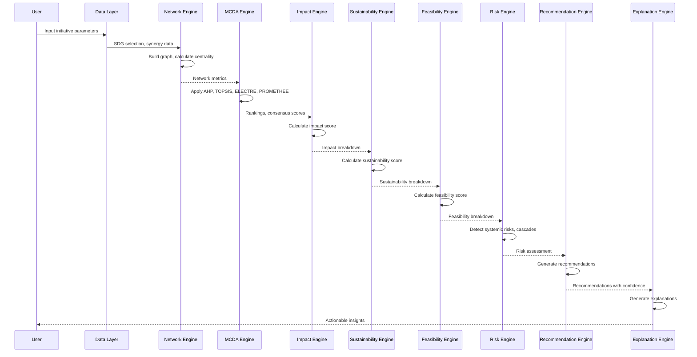

# Decision Intelligence

This document explains how the SDG Decision Intelligence Framework transforms raw data into actionable recommendations through a systematic pipeline of analytical engines.

---

## Table of Contents

1. [Decision Intelligence Overview](#decision-intelligence-overview)
2. [Transformation Pipeline](#transformation-pipeline)
3. [Network Analysis Stage](#network-analysis-stage)
4. [MCDA Stage](#mcda-stage)
5. [Impact Stage](#impact-stage)
6. [Sustainability Stage](#sustainability-stage)
7. [Recommendation Generation](#recommendation-generation)
8. [Explainability](#explainability)
9. [Decision Support Interface](#decision-support-interface)

---

## Decision Intelligence Overview

### Purpose

Decision Intelligence transforms data into decisions through a systematic, transparent, and explainable pipeline. Unlike black-box AI systems, every recommendation in this framework is mathematically traceable to first principles and documented assumptions.

### Core Principles

1. **Transparency**: Every decision step is visible and explainable
2. **Traceability**: Recommendations trace back to input data and assumptions
3. **Rigor**: Established analytical methods from decision science
4. **Uncertainty Awareness**: Confidence intervals and sensitivity analysis
5. **Actionability**: Clear, specific recommendations with implementation guidance

### Decision Intelligence vs. Traditional Analytics

| Aspect | Traditional Analytics | Decision Intelligence |
|--------|----------------------|----------------------|
| Goal | Describe what happened | Prescribe what to do |
| Output | Dashboards, reports | Recommendations, actions |
| Transparency | Variable | High priority |
| Uncertainty | Often ignored | Explicitly quantified |
| Explainability | Limited | Fundamental |
| User Role | Observer | Decision-maker |

---

## Transformation Pipeline

### High-Level Pipeline

```mermaid
graph LR
    A[Raw Data] --> B[Network Analysis]
    B --> C[MCDA]
    C --> D[Impact Assessment]
    D --> E[Sustainability Evaluation]
    E --> F[Feasibility Analysis]
    F --> G[Risk Assessment]
    G --> H[Recommendation Generation]
    H --> I[Explanation Generation]
    I --> J[Decision Support]
    
    style A fill:#e1f5ff
    style B fill:#fff4e1
    style C fill:#ffe1e1
    style D fill:#e1ffe1
    style E fill:#f5e1ff
    style F fill:#e1f5ff
    style G fill:#fff4e1
    style H fill:#ffe1e1
    style I fill:#e1ffe1
    style J fill:#f5e1ff
```



### Data Transformation Flow



### Stage Outputs

| Stage | Input | Output | Key Metrics |
|-------|-------|--------|-------------|
| Network Analysis | SDG selection | Centrality scores, communities | Degree, betweenness, PageRank |
| MCDA | Initiative criteria | Rankings, consensus scores | AHP, TOPSIS, ELECTRE, PROMETHEE |
| Impact | Initiative parameters | Impact score, breakdown | Budget efficiency, risk-adjusted return |
| Sustainability | Initiative parameters | Sustainability score, breakdown | Environmental alignment, long-term viability |
| Feasibility | Initiative parameters | Feasibility score, breakdown | Dependency complexity, team capacity |
| Risk Assessment | Initiative portfolio | Risk report, cascades | Systemic risks, risk clusters |
| Recommendation | All scores | Recommendations, actions | Priorities, confidence intervals |
| Explanation | All results | Explanations, rationale | Factor contributions, uncertainty |

---

## Network Analysis Stage

### Purpose

Network analysis transforms SDG selection into structural insights about strategic positioning, network effects, and influence potential.

### Input Transformation

**Input**: SDG selection (e.g., [4, 8, 9, 13])

**Process**:
1. Construct SDG network graph
2. Calculate centrality measures
3. Detect communities
4. Identify critical paths

**Output**: Network metrics and structural insights

### Transformation Logic

```typescript
function transformSDGSelection(sdgIds: number[]): NetworkInsights {
  // Build graph
  const graph = buildSDGGraph(sdgIds);
  
  // Calculate centrality
  const degreeCentrality = calculateDegreeCentrality(graph);
  const betweennessCentrality = calculateBetweennessCentrality(graph);
  const pageRank = calculatePageRank(graph);
  
  // Detect communities
  const communities = detectCommunities(graph);
  
  // Identify structural insights
  const insights = {
    strategicPosition: calculateStrategicPosition(degreeCentrality, pageRank),
    networkEffects: calculateNetworkEffects(graph),
    bridgeSDGs: identifyBridgeSDGs(betweennessCentrality),
    communityCohesion: calculateCommunityCohesion(communities)
  };
  
  return insights;
}
```

### Decision-Relevant Outputs

#### Strategic Position

**Question**: "How strategically positioned are the selected SDGs?"

**Transformation**:
```
Strategic Position = α × (avgDegreeCentrality) + β × (avgPageRank) + γ × (avgBetweenness)
```

**Interpretation**:
- High strategic position: Selected SDGs are central and influential
- Low strategic position: Selected SDGs are peripheral

**Decision Impact**: High strategic position → prioritize for network effects

#### Network Effects

**Question**: "What multiplier effects will this initiative create?"

**Transformation**:
```
Network Effects = Σ(edge weights) × (avg centrality of connected nodes)
```

**Interpretation**:
- High network effects: Progress will amplify through network
- Low network effects: Limited multiplier effects

**Decision Impact**: High network effects → leverage for systemic impact

#### Bridge SDGs

**Question**: "Which SDGs act as bridges to other goals?"

**Transformation**:
```
Bridge SDGs = {SDG | betweennessCentrality > threshold}
```

**Interpretation**:
- Bridge SDGs connect network segments
- Targeting bridges enables cross-sector influence

**Decision Impact**: Bridge SDGs → prioritize for cross-cutting impact

---

## MCDA Stage

### Purpose

Multi-Criteria Decision Analysis transforms initiative criteria into rankings and consensus scores using established decision science methods.

### Input Transformation

**Input**: Initiative criteria (impact, sustainability, feasibility, SDG alignment scores)

**Process**:
1. Apply AHP (hierarchical pairwise comparison)
2. Apply TOPSIS (distance to ideal solution)
3. Apply ELECTRE (outranking relations)
4. Apply PROMETHEE (preference flows)
5. Compute consensus ranking (Borda count)

**Output**: Rankings, consensus scores, method comparison

### Transformation Logic

```typescript
function transformCriteriaToRankings(
  initiatives: Initiative[],
  criteria: Criterion[]
): MCDAInsights {
  // Apply each method
  const ahpResult = ahp(initiatives, criteria);
  const topsisResult = topsis(initiatives, criteria);
  const electreResult = electre(initiatives, criteria);
  const prometheeResult = promethee(initiatives, criteria);
  
  // Compute consensus
  const consensusResult = consensusRanking(initiatives, criteria);
  
  // Compare methods
  const comparison = compareMethods({
    ahp: ahpResult,
    topsis: topsisResult,
    electre: electreResult,
    promethee: prometheeResult,
    consensus: consensusResult
  });
  
  // Generate insights
  const insights = {
    consensusRanking: consensusResult.ranking,
    methodAgreement: calculateMethodAgreement(comparison),
    rankingStability: calculateRankingStability(comparison),
    criticalInitiatives: identifyCriticalInitiatives(consensusResult)
  };
  
  return insights;
}
```

### Decision-Relevant Outputs

#### Consensus Ranking

**Question**: "Which initiatives rank highest across all methods?"

**Transformation**:
```
Consensus Score = Σ(methodRankingScore) / numberOfMethods
```

**Interpretation**:
- High consensus score: Ranks consistently high across methods
- Low consensus score: Ranks vary across methods (sensitive to method choice)

**Decision Impact**: High consensus → proceed with confidence

#### Method Agreement

**Question**: "How much do different MCDA methods agree?"

**Transformation**:
```
Method Agreement = 1 - (average ranking disagreement)
```

**Interpretation**:
- High agreement: Methods converge on similar rankings
- Low agreement: Rankings sensitive to method choice

**Decision Impact**: High agreement → robust ranking; low agreement → sensitivity analysis needed

#### Ranking Stability

**Question**: "How stable are rankings under parameter perturbations?"

**Transformation**:
```
Ranking Stability = frequency of ranking position across scenarios
```

**Interpretation**:
- High stability: Ranking robust to parameter changes
- Low stability: Ranking sensitive to parameter uncertainty

**Decision Impact**: High stability → confident ranking; low stability → caution needed

---

## Impact Stage

### Purpose

The Impact stage transforms initiative parameters into an impact assessment that quantifies potential benefit per unit resource.

### Input Transformation

**Input**: Initiative parameters (budget, timeline, beneficiaries, SDGs, risks)

**Process**:
1. Calculate budget efficiency
2. Calculate risk-adjusted return
3. Calculate synergy strength
4. Calculate time efficiency
5. Calculate cross-sector coverage
6. Compute weighted impact score

**Output**: Impact score, factor breakdown, improvement recommendations

### Transformation Logic

```typescript
function transformParametersToImpact(
  initiative: Initiative
): ImpactInsights {
  // Calculate factors
  const budgetEfficiency = calculateBudgetEfficiency(initiative);
  const riskAdjustedReturn = calculateRiskAdjustedReturn(initiative);
  const synergyStrength = calculateSynergyStrength(initiative);
  const timeEfficiency = calculateTimeEfficiency(initiative);
  const crossSectorCoverage = calculateCrossSectorCoverage(initiative);
  
  // Compute weighted score
  const impactScore = calculateImpactScore(initiative);
  
  // Generate insights
  const insights = {
    overallImpact: impactScore.score,
    strengths: identifyStrengths(impactScore.factors),
    weaknesses: identifyWeaknesses(impactScore.factors),
    improvementOpportunities: generateImprovementRecommendations(impactScore.factors),
    impactPerDollar: calculateImpactPerDollar(initiative),
    timeToImpact: calculateTimeToImpact(initiative)
  };
  
  return insights;
}
```

### Decision-Relevant Outputs

#### Impact Per Dollar

**Question**: "How much impact do we get per dollar spent?"

**Transformation**:
```
Impact Per Dollar = (Overall Impact Score) / Budget
```

**Interpretation**:
- High impact per dollar: Efficient resource use
- Low impact per dollar: Inefficient resource use

**Decision Impact**: High impact per dollar → prioritize for efficiency

#### Time to Impact

**Question**: "How quickly will impact be delivered?"

**Transformation**:
```
Time to Impact = Timeline × (1 - Time Efficiency Score / 100)
```

**Interpretation**:
- Short time to impact: Rapid benefit delivery
- Long time to impact: Delayed benefit delivery

**Decision Impact**: Short time to impact → prioritize for urgency

#### Improvement Opportunities

**Question**: "Which factors can be improved to increase impact?"

**Transformation**:
```
Improvement Opportunity = (100 - factorScore) × factorWeight × improvementPotential
```

**Interpretation**:
- High improvement opportunity: Large potential gain from improving factor
- Low improvement opportunity: Limited potential gain

**Decision Impact**: High improvement opportunity → target for optimization

---

## Sustainability Stage

### Purpose

The Sustainability stage transforms initiative parameters into a sustainability assessment that evaluates long-term viability and environmental alignment.

### Input Transformation

**Input**: Initiative parameters (timeline, SDGs, infrastructure, resources)

**Process**:
1. Calculate environmental alignment
2. Calculate long-term viability
3. Calculate resource optimization
4. Calculate infrastructure sustainability
5. Compute weighted sustainability score

**Output**: Sustainability score, factor breakdown, longevity assessment

### Transformation Logic

```typescript
function transformParametersToSustainability(
  initiative: Initiative
): SustainabilityInsights {
  // Calculate factors
  const environmentalAlignment = calculateEnvironmentalAlignment(initiative);
  const longTermViability = calculateLongTermViability(initiative);
  const resourceOptimization = calculateResourceOptimization(initiative);
  const infrastructureSustainability = calculateInfrastructureSustainability(initiative);
  
  // Compute weighted score
  const sustainabilityScore = calculateSustainabilityScore(initiative);
  
  // Generate insights
  const insights = {
    overallSustainability: sustainabilityScore.score,
    environmentalScore: environmentalAlignment,
    longevityRisk: calculateLongevityRisk(initiative),
    resourceEfficiency: resourceOptimization,
    sustainabilityGap: calculateSustainabilityGap(sustainabilityScore),
    maintenanceRequirements: estimateMaintenanceRequirements(initiative)
  };
  
  return insights;
}
```

### Decision-Relevant Outputs

#### Longevity Risk

**Question**: "What is the risk that benefits will not persist?"

**Transformation**:
```
Longevity Risk = 1 - (Long-term Viability Score / 100)
```

**Interpretation**:
- High longevity risk: Benefits likely to fade quickly
- Low longevity risk: Benefits likely to persist

**Decision Impact**: High longevity risk → require sustainability plan

#### Sustainability Gap

**Question**: "How far is the initiative from sustainability targets?"

**Transformation**:
```
Sustainability Gap = (Target Sustainability Score - Actual Score)
```

**Interpretation**:
- Large sustainability gap: Significant improvement needed
- Small sustainability gap: Near target

**Decision Impact**: Large sustainability gap → require sustainability investments

#### Maintenance Requirements

**Question**: "What ongoing maintenance is needed to sustain benefits?"

**Transformation**:
```
Maintenance Requirements = f(infrastructure, timeline, complexity)
```

**Interpretation**:
- High maintenance requirements: Significant ongoing resource needs
- Low maintenance requirements: Minimal ongoing resource needs

**Decision Impact**: High maintenance → budget for long-term operations

---

## Recommendation Generation

### Purpose

Recommendation generation transforms all analytical results into actionable, prioritized recommendations with implementation guidance.

### Input Transformation

**Input**: All stage outputs (network insights, MCDA rankings, impact assessment, sustainability evaluation, feasibility analysis, risk assessment)

**Process**:
1. Synthesize insights across all stages
2. Identify strengths, opportunities, risks
3. Generate specific recommendations
4. Prioritize by impact and feasibility
5. Add implementation guidance
6. Quantify confidence and uncertainty

**Output**: Prioritized recommendations with confidence intervals

### Transformation Logic

```typescript
function transformResultsToRecommendations(
  networkInsights: NetworkInsights,
  mcdaInsights: MCDAInsights,
  impactInsights: ImpactInsights,
  sustainabilityInsights: SustainabilityInsights,
  feasibilityInsights: FeasibilityInsights,
  riskInsights: RiskInsights
): Recommendation[] {
  const recommendations: Recommendation[] = [];
  
  // Identify strengths to leverage
  const strengths = identifyStrengths({
    network: networkInsights,
    impact: impactInsights,
    sustainability: sustainabilityInsights,
    feasibility: feasibilityInsights
  });
  
  // Generate leverage recommendations
  strengths.forEach(strength => {
    recommendations.push({
      type: 'leverage',
      priority: calculatePriority(strength),
      action: generateLeverageAction(strength),
      rationale: generateRationale(strength),
      confidence: calculateConfidence(strength),
      expectedImpact: estimateImpact(strength)
    });
  });
  
  // Identify weaknesses to address
  const weaknesses = identifyWeaknesses({
    network: networkInsights,
    impact: impactInsights,
    sustainability: sustainabilityInsights,
    feasibility: feasibilityInsights
  });
  
  // Generate improvement recommendations
  weaknesses.forEach(weakness => {
    recommendations.push({
      type: 'improve',
      priority: calculatePriority(weakness),
      action: generateImprovementAction(weakness),
      rationale: generateRationale(weakness),
      confidence: calculateConfidence(weakness),
      expectedImpact: estimateImpact(weakness)
    });
  });
  
  // Identify risks to mitigate
  riskInsights.risks.forEach(risk => {
    recommendations.push({
      type: 'mitigate',
      priority: risk.severity,
      action: generateMitigationAction(risk),
      rationale: risk.description,
      confidence: risk.probability,
      expectedImpact: risk.impact
    });
  });
  
  // Prioritize and sort
  return recommendations
    .sort((a, b) => b.priority - a.priority)
    .map((rec, index) => ({...rec, rank: index + 1}));
}
```

### Recommendation Types

#### Leverage Recommendations

**Purpose**: Capitalize on existing strengths

**Example**:
```
Type: Leverage
Priority: High
Action: Expand SDG selection to include bridge SDGs (SDG 9, SDG 17)
Rationale: Current selection has high strategic position; adding bridges amplifies network effects
Confidence: 85%
Expected Impact: +15% overall score
```

#### Improve Recommendations

**Purpose**: Address identified weaknesses

**Example**:
```
Type: Improve
Priority: Medium
Action: Increase budget allocation to $1.2M to improve budget efficiency
Rationale: Current budget efficiency is below target (45/100); increase improves impact per dollar
Confidence: 70%
Expected Impact: +10% impact score
```

#### Mitigate Recommendations

**Purpose**: Reduce identified risks

**Example**:
```
Type: Mitigate
Priority: Critical
Action: Develop contingency plan for dependency on external infrastructure
Rationale: Blocking dependency on infrastructure creates systemic risk; contingency reduces cascade probability
Confidence: 90%
Expected Impact: -30% systemic risk score
```

#### Explore Recommendations

**Purpose**: Investigate uncertain areas

**Example**:
```
Type: Explore
Priority: Low
Action: Conduct pilot study to validate synergy coefficient assumptions
Rationale: High uncertainty in synergy strength affects impact score; pilot reduces uncertainty
Confidence: 60%
Expected Impact: ±5% impact score (reduced uncertainty)
```

### Prioritization Framework

**Priority Calculation**:
```
Priority = (Impact × Urgency × Feasibility) / Uncertainty
```

Where:
- **Impact**: Expected improvement magnitude (0-100)
- **Urgency**: Time sensitivity (0-100)
- **Feasibility**: Implementation ease (0-100)
- **Uncertainty**: Confidence inverse (0-100)

**Priority Levels**:
- **Critical** (80-100): Immediate action required
- **High** (60-79): Action within 1 month
- **Medium** (40-59): Action within 3 months
- **Low** (0-39): Action when resources available

---

## Explainability

### Purpose

Explainability transforms analytical results into human-readable explanations that make the decision rationale transparent and understandable.

### Explanation Generation

```typescript
function generateExplanation(
  initiative: Initiative,
  scores: InitiativeScores,
  recommendations: Recommendation[]
): Explanation {
  const explanation = {
    summary: generateSummary(scores),
    scoreBreakdown: generateScoreBreakdown(scores),
    keyDrivers: identifyKeyDrivers(scores),
    rationale: generateRationale(recommendations),
    uncertainty: quantifyUncertainty(scores),
    assumptions: documentAssumptions(initiative),
    limitations: documentLimitations(scores)
  };
  
  return explanation;
}
```

### Explanation Components

#### Summary

**Purpose**: High-level overview of initiative quality

**Template**:
```
This initiative scores {overallScore}/100 overall, with {strengths} as strengths and {weaknesses} as areas for improvement. The initiative is {classification} for implementation.
```

**Example**:
```
This initiative scores 67/100 overall, with strong impact (72/100) and sustainability (71/100) as strengths, and moderate feasibility (58/100) as an area for improvement. The initiative is recommended for implementation with minor optimization.
```

#### Score Breakdown

**Purpose**: Detailed explanation of each score

**Template**:
```
{Metric} Score: {score}/100
- {Factor1}: {value} ({impact}) - {description}
- {Factor2}: {value} ({impact}) - {description}
...
Weight: {weight}% of overall score
Contribution: {contribution} points
```

**Example**:
```
Impact Score: 72/100
- Budget Efficiency: 65 (neutral) - B = (1M/budget) × 50 (OECD efficiency metric)
- Risk-Adjusted Return: 80 (positive) - R = (1 - avgRiskProb) × 100 (World Bank risk model)
- Synergy Strength: 75 (positive) - S = avg(coefficient) × 100 (UN SDSN 2019)
- Time Efficiency: 60 (neutral) - T = (12/timeline) × 100 (inverse relationship)
- Cross-Sector Coverage: 35 (negative) - C = (SDG count/17) × 100 (coverage metric)
Weight: 35% of overall score
Contribution: 25.2 points
```

#### Key Drivers

**Purpose**: Identify factors with greatest influence

**Algorithm**:
```typescript
function identifyKeyDrivers(scores: InitiativeScores): KeyDriver[] {
  const drivers: KeyDriver[] = [];
  
  Object.values(scores.breakdowns).forEach(breakdown => {
    breakdown.factors.forEach(factor => {
      const influence = factor.value × breakdown.weight;
      drivers.push({
        factor: factor.name,
        influence,
        direction: factor.impact,
        recommendation: factor.impact === 'negative' 
          ? 'Improve this factor' 
          : 'Leverage this strength'
      });
    });
  });
  
  return drivers.sort((a, b) => Math.abs(b.influence) - Math.abs(a.influence));
}
```

**Example**:
```
Key Drivers:
1. Risk-Adjusted Return: +20.0 points (positive) - Leverage this strength
2. Synergy Strength: +15.0 points (positive) - Leverage this strength
3. Cross-Sector Coverage: -3.5 points (negative) - Improve this factor
4. Time Efficiency: -2.7 points (negative) - Improve this factor
```

#### Rationale

**Purpose**: Explain why recommendations are made

**Template**:
```
Recommendation: {action}
Rationale: {reason}
Evidence: {evidence}
Confidence: {confidence}%
```

**Example**:
```
Recommendation: Expand SDG selection to include SDG 9 and SDG 17
Rationale: Current selection has high strategic position (degree centrality: 0.82) but limited network effects. Adding bridge SDGs (betweenness centrality > 0.15) amplifies influence through network propagation.
Evidence: Network analysis shows SDG 9 and SDG 17 have betweenness centrality of 0.18 and 0.21 respectively, acting as bridges between economic and environmental communities.
Confidence: 85%
```

#### Uncertainty Quantification

**Purpose**: Communicate confidence in results

**Template**:
```
Overall Score: {mean} ± {stdDev} (95% CI: [{lower}, {upper}])
Confidence Level: {level}
Key Uncertainties: {uncertainties}
```

**Example**:
```
Overall Score: 67 ± 8.5 (95% CI: [50, 84])
Confidence Level: Medium
Key Uncertainties:
- Budget estimates: ±15% variability
- Risk probabilities: ±0.1 estimation error
- Synergy coefficients: ±0.05 context variation
```

#### Assumptions Documentation

**Purpose**: Make assumptions explicit

**Template**:
```
Assumptions:
1. {assumption1} - {implication}
2. {assumption2} - {implication}
...
```

**Example**:
```
Assumptions:
1. Budget estimates are realistic and include all costs - Overestimation may underestimate budget efficiency
2. Risk probabilities are accurate - Underestimation may overestimate risk-adjusted return
3. Synergy coefficients apply to this context - Context variation may affect synergy strength
4. Timeline is achievable with provided resources - Delays may reduce time efficiency
```

#### Limitations Documentation

**Purpose**: Acknowledge model limitations

**Template**:
```
Limitations:
1. {limitation1} - {mitigation}
2. {limitation2} - {mitigation}
...
```

**Example**:
```
Limitations:
1. Linear relationships between inputs and scores - May not capture non-linear effects; sensitivity analysis recommended
2. Static synergy coefficients - May not reflect temporal dynamics; consider context-specific calibration
3. Independence of factors - May have unmodeled interactions; expert review recommended
4. Point-in-time analysis - Does not account for future changes; periodic re-evaluation recommended
```

---

## Decision Support Interface

### Purpose

The decision support interface presents analytical results and recommendations in an interactive, user-friendly format that enables effective decision-making.

### Interface Components

#### Executive Dashboard

**Purpose**: High-level overview for decision-makers

**Components**:
- Overall score with confidence interval
- Key metrics at a glance
- Top 3 recommendations
- Risk alerts
- Trend indicators

#### Detailed Analysis Panel

**Purpose**: Deep-dive into specific aspects

**Components**:
- Score breakdown with factor details
- Network visualization with centrality metrics
- MCDA method comparison
- Sensitivity analysis results
- Monte Carlo simulation results

#### Recommendation Panel

**Purpose**: Actionable guidance

**Components**:
- Prioritized recommendation list
- Implementation guidance
- Expected impact estimates
- Confidence levels
- Resource requirements

#### Scenario Explorer

**Purpose**: Explore "what-if" scenarios

**Components**:
- Parameter adjustment sliders
- Real-time score updates
- Scenario comparison
- Sensitivity visualization

### User Interaction Patterns

#### Exploratory Analysis

1. User inputs initiative parameters
2. System calculates scores and recommendations
3. User explores score breakdown
4. User adjusts parameters in scenario explorer
5. System updates scores in real-time
6. User compares scenarios
7. User makes decision

#### Validation Workflow

1. User inputs initiative parameters
2. System calculates scores
3. User reviews score breakdown
4. User runs sensitivity analysis
5. User reviews uncertainty quantification
6. User validates assumptions
7. User approves or revises

#### Comparison Workflow

1. User inputs multiple initiatives
2. System calculates scores for all
3. User views comparison dashboard
4. User runs MCDA ranking
5. User reviews consensus ranking
6. User selects top initiative
7. User reviews detailed analysis

### Decision Support Features

#### Confidence Indicators

**Visual Encoding**:
- Green (high confidence): stdDev < 5
- Yellow (medium confidence): stdDev 5-10
- Red (low confidence): stdDev > 10

#### Trend Indicators

**Visual Encoding**:
- Up arrow (increasing): score improving over time
- Right arrow (stable): score stable
- Down arrow (decreasing): score declining

#### Alert System

**Alert Types**:
- Critical: Requires immediate attention
- Warning: Should be addressed soon
- Info: For awareness only

#### Export Capabilities

**Export Formats**:
- PDF: Executive summary
- Excel: Detailed data
- JSON: Machine-readable
- DOCX: Full report

---

## Conclusion

The Decision Intelligence pipeline transforms raw data into actionable recommendations through a systematic, transparent, and explainable process. By combining:

- **Network Analysis** for structural insights
- **MCDA** for rigorous ranking
- **Impact Assessment** for benefit quantification
- **Sustainability Evaluation** for longevity assessment
- **Risk Analysis** for uncertainty quantification
- **Recommendation Generation** for actionable guidance
- **Explainability** for transparency

The framework enables decision-makers to:

- **Understand** the rationale behind recommendations
- **Trust** the analytical process through transparency
- **Act** with confidence through uncertainty quantification
- **Improve** decisions through systematic analysis

This transforms SDG initiative evaluation from intuitive assessment into rigorous decision intelligence grounded in established analytical methods and transparent reasoning.
