# Scoring Systems

This document provides a comprehensive explanation of all scoring systems used in the SDG Decision Intelligence Framework, including mathematical formulations, input requirements, interpretation guidelines, limitations, and examples.

---

## Table of Contents

1. [Scoring Framework Overview](#scoring-framework-overview)
2. [Impact Score](#impact-score)
3. [Sustainability Score](#sustainability-score)
4. [Feasibility Score](#feasibility-score)
5. [SDG Alignment Score](#sdg-alignment-score)
6. [Overall Score](#overall-score)
7. [Systemic Influence Score](#systemic-influence-score)
8. [Complexity Score](#complexity-score)
9. [Score Normalization](#score-normalization)
10. [Score Interpretation Guidelines](#score-interpretation-guidelines)

---

## Scoring Framework Overview

The framework employs a multi-dimensional scoring system to evaluate initiatives across complementary dimensions. Each score is mathematically formulated with traceable inputs and documented assumptions.

### Scoring Philosophy

1. **Traceability**: Every score can be traced to first principles and input data
2. **Evidence-Based**: Formulas derived from established research and frameworks
3. **Balanced**: Multiple dimensions prevent single-optimization bias
4. **Actionable**: Scores provide clear improvement direction
5. **Transparent**: All assumptions and limitations documented

### Score Hierarchy

```mermaid
graph TB
    A[Overall Score] --> B[Impact Score]
    A --> C[Sustainability Score]
    A --> D[Feasibility Score]
    A --> E[SDG Alignment Score]
    
    B --> B1[Budget Efficiency]
    B --> B2[Risk-Adjusted Return]
    B --> B3[Synergy Strength]
    B --> B4[Time Efficiency]
    B --> B5[Cross-Sector Coverage]
    
    C --> C1[Environmental Alignment]
    C --> C2[Long-term Viability]
    C --> C3[Resource Optimization]
    C --> C4[Infrastructure Sustainability]
    
    D --> D1[Dependency Complexity]
    D --> D2[Team Capacity]
    D --> D3[Risk Tolerance]
    D --> D4[Infrastructure Readiness]
    
    E --> E1[SDG Coverage]
    E --> E2[Synergy Network]
    E --> E3[Diversity Index]
    E --> E4[Strategic Alignment]
```



### Score Properties

| Score | Range | Weight in Overall | Primary Purpose |
|-------|-------|-------------------|-----------------|
| Impact | 0-100 | 35% | Measure potential benefit |
| Sustainability | 0-100 | 25% | Assess long-term viability |
| Feasibility | 0-100 | 25% | Evaluate implementability |
| SDG Alignment | 0-100 | 15% | Measure strategic fit |
| Overall | 0-100 | 100% | Composite evaluation |

---

## Impact Score

### Purpose

The Impact Score measures the potential benefit an initiative can deliver, accounting for efficiency, risk, synergies, timing, and coverage. It answers: "How much good will this initiative do per unit of resource?"

### Formula

```
I = 0.30·B + 0.25·R + 0.20·S + 0.15·T + 0.10·C
```

Where:
- **B** = Budget Efficiency
- **R** = Risk-Adjusted Return
- **S** = Synergy Strength
- **T** = Time Efficiency
- **C** = Cross-Sector Coverage

### Factor Calculations

#### Budget Efficiency (B)

**Formula**:
```
B = min(100, (1,000,000 / budget) × 50)
```

**Inputs**:
- `budget` (number): Estimated budget in currency units

**Interpretation**:
- Higher score: More beneficiaries per dollar spent
- Lower score: Higher cost per beneficiary
- Capped at 100 to prevent extreme values

**Example**:
- Budget: $500,000
- B = (1,000,000 / 500,000) × 50 = 2 × 50 = 100
- Budget: $2,000,000
- B = (1,000,000 / 2,000,000) × 50 = 0.5 × 50 = 25

**Evidence Base**: OECD Development Effectiveness Metrics (2022)

**Limitations**:
- Assumes linear relationship between budget and beneficiaries
- Does not account for diminishing returns at scale
- Sensitive to budget estimate accuracy

---

#### Risk-Adjusted Return (R)

**Formula**:
```
R = (1 - avgRiskProbability) × 100
```

**Inputs**:
- `risks` (array): Array of risk objects with probability field
- `avgRiskProbability` = Σ(probability) / number of risks

**Interpretation**:
- Higher score: Lower overall risk probability
- Lower score: Higher likelihood of negative outcomes
- Range: 0-100 (0 = certain failure, 100 = risk-free)

**Example**:
- Risks: [{probability: 0.2}, {probability: 0.3}, {probability: 0.1}]
- avgRiskProbability = (0.2 + 0.3 + 0.1) / 3 = 0.2
- R = (1 - 0.2) × 100 = 80

**Evidence Base**: World Bank Project Risk Assessment Framework (2021)

**Limitations**:
- Assumes risks are independent
- Does not account for risk impact magnitude
- Subjective probability estimates may be biased

---

#### Synergy Strength (S)

**Formula**:
```
S = avg(coefficient) × 100
```

**Inputs**:
- `sdgIds` (array): Array of selected SDG IDs
- `coefficient` = synergy coefficient between SDG pairs from research

**Calculation**:
```typescript
const synergies: number[] = [];
for (let i = 0; i < sdgIds.length; i++) {
  for (let j = i + 1; j < sdgIds.length; j++) {
    synergies.push(Math.abs(getCoefficient(sdgIds[i], sdgIds[j])));
  }
}
const synergyStrength = synergies.length > 0 
  ? (synergies.reduce((sum, s) => sum + s, 0) / synergies.length) × 100 
  : 0;
```

**Interpretation**:
- Higher score: Strong synergistic relationships between SDGs
- Lower score: Weak or conflicting SDG interactions
- Range: 0-100

**Example**:
- SDGs: [4, 8, 9]
- Coefficients: 4↔8 = 0.8, 4↔9 = 0.6, 8↔9 = 0.7
- avg = (0.8 + 0.6 + 0.7) / 3 = 0.7
- S = 0.7 × 100 = 70

**Evidence Base**: UN SDSN Synergy Research (2019)

**Limitations**:
- Uses absolute value, treats conflicts and synergies equally
- Assumes synergy coefficients apply to all contexts
- Does not account for synergy strength variation

---

#### Time Efficiency (T)

**Formula**:
```
T = min(100, (12 / timeline) × 100)
```

**Inputs**:
- `timeline` (number): Project duration in months

**Interpretation**:
- Higher score: Faster impact delivery (shorter timeline)
- Lower score: Slower impact delivery (longer timeline)
- Baseline: 12 months = 100 points

**Example**:
- Timeline: 6 months
- T = (12 / 6) × 100 = 2 × 100 = 200 → capped at 100
- Timeline: 24 months
- T = (12 / 24) × 100 = 0.5 × 100 = 50

**Evidence Base**: Project management best practices

**Limitations**:
- Inverse relationship may not always hold (some initiatives need time)
- Does not account for implementation quality
- May incentivize unrealistic timelines

---

#### Cross-Sector Coverage (C)

**Formula**:
```
C = (SDG count / 17) × 100
```

**Inputs**:
- `sdgIds` (array): Array of selected SDG IDs
- `SDG count` = length of sdgIds array

**Interpretation**:
- Higher score: Broader coverage across SDG sectors
- Lower score: Narrower focus on fewer SDGs
- Maximum: 17 SDGs = 100 points

**Example**:
- SDGs: [1, 2, 3] (3 goals)
- C = (3 / 17) × 100 = 17.6
- SDGs: [1, 2, 3, 4, 5, 6, 7, 8] (8 goals)
- C = (8 / 17) × 100 = 47.1

**Evidence Base**: UN SDG Framework (2023)

**Limitations**:
- Assumes breadth is always better than depth
- Does not account for SDG importance weighting
- May incentivize unfocused "checklist" approaches

---

### Impact Score Interpretation

| Score Range | Interpretation | Action |
|-------------|----------------|--------|
| 80-100 | Exceptional impact potential | Proceed with confidence |
| 60-79 | Good impact potential | Minor optimization recommended |
| 40-59 | Moderate impact potential | Significant improvement needed |
| 0-39 | Limited impact potential | Major redesign required |

### Impact Score Example

**Initiative Parameters**:
- Budget: $750,000
- Timeline: 18 months
- SDGs: [4, 8, 9]
- Risks: [{probability: 0.15}, {probability: 0.25}]

**Factor Calculations**:
- B = (1,000,000 / 750,000) × 50 = 66.7
- R = (1 - 0.2) × 100 = 80
- S = 70 (from example above)
- T = (12 / 18) × 100 = 66.7
- C = (3 / 17) × 100 = 17.6

**Weighted Score**:
```
I = 0.30 × 66.7 + 0.25 × 80 + 0.20 × 70 + 0.15 × 66.7 + 0.10 × 17.6
I = 20.0 + 20.0 + 14.0 + 10.0 + 1.8
I = 65.8
```

**Interpretation**: Good impact potential (65.8/100). Strengths in risk-adjusted return and synergy. Opportunities to improve budget efficiency and cross-sector coverage.

---

## Sustainability Score

### Purpose

The Sustainability Score assesses the long-term viability and environmental alignment of an initiative. It answers: "Will this initiative create lasting, sustainable change?"

### Formula

```
S = 0.35·E + 0.30·L + 0.20·R + 0.15·I
```

Where:
- **E** = Environmental Alignment
- **L** = Long-term Viability
- **R** = Resource Optimization
- **I** = Infrastructure Sustainability

### Factor Calculations

#### Environmental Alignment (E)

**Formula**:
```
E = (envSDGs / totalSDGs) × 100
```

**Inputs**:
- `sdgIds` (array): Array of selected SDG IDs
- `envSDGs` = count of SDGs in {6, 7, 11, 12, 13, 14, 15}

**Interpretation**:
- Higher score: Strong alignment with environmental SDGs
- Lower score: Limited environmental focus
- Environmental SDGs: 6 (Water), 7 (Energy), 11 (Cities), 12 (Consumption), 13 (Climate), 14 (Life Below Water), 15 (Life on Land)

**Example**:
- SDGs: [6, 7, 13, 4, 8]
- envSDGs = 3 (6, 7, 13)
- totalSDGs = 5
- E = (3 / 5) × 100 = 60

**Evidence Base**: UN Environmental Sustainability Framework (2022)

**Limitations**:
- Assumes environmental SDGs have higher sustainability value
- Does not account for environmental impact of non-environmental SDGs
- May undervalue social sustainability

---

#### Long-term Viability (L)

**Formula**:
```
L = min(100, (timeline / 36) × 50 + 50)
```

**Inputs**:
- `timeline` (number): Project duration in months

**Interpretation**:
- Higher score: Longer duration suggests lasting impact
- Lower score: Short-term initiatives may not persist
- Baseline: 36 months = 100 points

**Example**:
- Timeline: 24 months
- L = (24 / 36) × 50 + 50 = 33.3 + 50 = 83.3
- Timeline: 12 months
- L = (12 / 36) × 50 + 50 = 16.7 + 50 = 66.7

**Evidence Base**: OECD Green Growth Metrics (2021)

**Limitations**:
- Assumes duration correlates with sustainability
- Does not account for maintenance requirements
- May incentivize unnecessarily long projects

---

#### Resource Optimization (R)

**Formula**:
```
R = min(100, (budget / staff) / 10,000 × 100)
```

**Inputs**:
- `budget` (number): Estimated budget
- `staff` (number): Required staff count

**Interpretation**:
- Higher score: Efficient resource allocation (adequate budget per staff)
- Lower score: Resource inefficiency (overstaffed relative to budget)
- Baseline: $10,000 per staff = 100 points

**Example**:
- Budget: $500,000, Staff: 10
- R = (500,000 / 10) / 10,000 × 100 = 50 × 100 = 500 → capped at 100
- Budget: $100,000, Staff: 10
- R = (100,000 / 10) / 10,000 × 100 = 10 × 100 = 100

**Evidence Base**: World Bank Sustainability Assessment Guidelines (2020)

**Limitations**:
- Assumes higher budget per staff is always better
- Does not account for staff expertise or efficiency
- May incentivize over-budgeting

---

#### Infrastructure Sustainability (I)

**Formula**:
```
I = infrastructure assessment index (50-70)
```

**Inputs**:
- `infrastructureRequirements` (array): Array of infrastructure requirement objects

**Interpretation**:
- Higher score: Adequate infrastructure supports sustainability
- Lower score: Infrastructure gaps threaten sustainability
- Binary assessment based on presence/absence of requirements

**Example**:
- Infrastructure requirements present: I = 70
- No infrastructure requirements: I = 50

**Evidence Base**: Infrastructure sustainability literature

**Limitations**:
- Simplified binary assessment
- Does not account for infrastructure quality
- Subjective assessment criteria

---

### Sustainability Score Interpretation

| Score Range | Interpretation | Action |
|-------------|----------------|--------|
| 75-100 | Excellent long-term viability | Proceed with confidence |
| 50-74 | Good sustainability profile | Minor improvements recommended |
| 25-49 | Moderate sustainability | Significant attention needed |
| 0-24 | Low sustainability | Major redesign required |

---

## Feasibility Score

### Purpose

The Feasibility Score evaluates the practical implementability of an initiative. It answers: "Can this initiative be successfully executed with available resources?"

### Formula

```
F = 0.35·D + 0.25·T + 0.25·R + 0.15·I
```

Where:
- **D** = Dependency Complexity
- **T** = Team Capacity
- **R** = Risk Tolerance
- **I** = Infrastructure Readiness

### Factor Calculations

#### Dependency Complexity (D)

**Formula**:
```
D = max(0, 100 - (blockingDeps × 20))
```

**Inputs**:
- `dependencies` (array): Array of dependency objects
- `blockingDeps` = count of dependencies with blocking = true

**Interpretation**:
- Higher score: Fewer blocking dependencies
- Lower score: Many blocking dependencies reduce feasibility
- Each blocking dependency reduces score by 20 points

**Example**:
- Blocking dependencies: 1
- D = 100 - (1 × 20) = 80
- Blocking dependencies: 3
- D = 100 - (3 × 20) = 40

**Evidence Base**: PMI Feasibility Framework (2020)

**Limitations**:
- Assumes all blocking dependencies are equally critical
- Does not account for dependency resolution difficulty
- May not capture implicit dependencies

---

#### Team Capacity (T)

**Formula**:
```
T = min(100, (20 / staff) × 50 + 50)
```

**Inputs**:
- `staff` (number): Required staff count

**Interpretation**:
- Higher score: Adequate team size relative to workload
- Lower score: Insufficient team size
- Baseline: 20 staff = 100 points

**Example**:
- Staff: 10
- T = (20 / 10) × 50 + 50 = 100 + 50 = 150 → capped at 100
- Staff: 30
- T = (20 / 30) × 50 + 50 = 33.3 + 50 = 83.3

**Evidence Base**: Project management standards

**Limitations**:
- Assumes team size correlates with capacity
- Does not account for team expertise or experience
- May incentivize overstaffing

---

#### Risk Tolerance (R)

**Formula**:
```
R = (1 - avgRiskProbability) × 100
```

**Inputs**:
- `risks` (array): Array of risk objects with probability field
- `avgRiskProbability` = Σ(probability) / number of risks

**Interpretation**:
- Higher score: Lower overall risk probability
- Lower score: Higher likelihood of negative outcomes
- Same calculation as Impact Score risk factor

**Example**:
- avgRiskProbability: 0.3
- R = (1 - 0.3) × 100 = 70

**Evidence Base**: Risk management best practices

**Limitations**:
- Assumes risks are independent
- Does not account for risk mitigation strategies
- Subjective probability estimates

---

#### Infrastructure Readiness (I)

**Formula**:
```
I = infrastructure readiness index (60-80)
```

**Inputs**:
- `infrastructureRequirements` (array): Array of infrastructure requirement objects

**Interpretation**:
- Higher score: Existing infrastructure supports implementation
- Lower score: Infrastructure gaps require investment
- Binary assessment based on presence/absence of requirements

**Example**:
- Infrastructure requirements present: I = 60
- No infrastructure requirements: I = 80

**Evidence Base**: Implementation readiness literature

**Limitations**:
- Simplified binary assessment
- Does not account for infrastructure quality
- Subjective assessment criteria

---

### Feasibility Score Interpretation

| Score Range | Interpretation | Action |
|-------------|----------------|--------|
| 75-100 | High feasibility | Proceed with confidence |
| 50-74 | Moderate feasibility | Address resource/coordination challenges |
| 25-49 | Challenging feasibility | Significant resource allocation needed |
| 0-24 | Low feasibility | Major barriers to implementation |

---

## SDG Alignment Score

### Purpose

The SDG Alignment Score measures how well an initiative aligns with the SDG framework, considering coverage, synergies, diversity, and strategic positioning. It answers: "How strategically aligned is this initiative with the SDGs?"

### Formula

```
A = 0.30·C + 0.35·S + 0.20·D + 0.15·N
```

Where:
- **C** = Coverage
- **S** = Synergy Network
- **D** = Diversity Index
- **N** = Strategic Alignment (Network Centrality)

### Factor Calculations

#### Coverage (C)

**Formula**:
```
C = min(100, (SDG count / 17) × 100)
```

**Inputs**:
- `sdgIds` (array): Array of selected SDG IDs
- `SDG count` = length of sdgIds array

**Interpretation**:
- Higher score: Broader coverage across SDGs
- Lower score: Narrower focus on fewer SDGs
- Same calculation as Impact Score cross-sector coverage

**Example**:
- SDGs: [1, 2, 3, 4, 5] (5 goals)
- C = (5 / 17) × 100 = 29.4

**Evidence Base**: UN SDG Framework (2023)

**Limitations**:
- Assumes breadth is always better
- Does not account for SDG importance
- May incentivize unfocused approaches

---

#### Synergy Network (S)

**Formula**:
```
S = min(100, (avgCoefficient + 1) × 50)
```

**Inputs**:
- `sdgIds` (array): Array of selected SDG IDs
- `avgCoefficient` = average of synergy coefficients between SDG pairs

**Interpretation**:
- Higher score: Strong synergistic network
- Lower score: Weak or conflicting network
- Range: 0-100 (coefficient -1 to +1 maps to 0 to 100)

**Example**:
- Coefficients: [0.8, 0.6, 0.7]
- avgCoefficient = 0.7
- S = (0.7 + 1) × 50 = 1.7 × 50 = 85

**Evidence Base**: UN SDSN Synergy Research (2019)

**Limitations**:
- Assumes all synergies are positive
- Does not account for conflict severity
- Context-dependent coefficient validity

---

#### Diversity Index (D)

**Formula**:
```
D = (1 - (conflictCount / totalPairs)) × 100
```

**Inputs**:
- `sdgIds` (array): Array of selected SDG IDs
- `conflictCount` = number of SDG pairs with negative coefficient
- `totalPairs` = number of SDG pairs = n(n-1)/2

**Interpretation**:
- Higher score: Fewer conflicts between SDGs
- Lower score: Many conflicts reduce alignment
- Range: 0-100

**Example**:
- SDGs: [8, 9, 13]
- Coefficients: 8↔9 = 0.7, 8↔13 = -0.4, 9↔13 = -0.3
- conflictCount = 2 (8↔13, 9↔13)
- totalPairs = 3
- D = (1 - 2/3) × 100 = 33.3

**Evidence Base**: Network Analysis of SDG Interdependencies (2020)

**Limitations**:
- Binary conflict classification (negative = conflict)
- Does not account for conflict severity
- May undervalue manageable conflicts

---

#### Strategic Alignment (N)

**Formula**:
```
N = strategic weights centrality index (60-80)
```

**Inputs**:
- `sdgAlignmentWeights` (object): Custom weights per SDG (optional)

**Interpretation**:
- Higher score: Strategic weights provided, indicating alignment
- Lower score: No strategic weights, default alignment
- Binary assessment based on presence/absence of weights

**Example**:
- Strategic weights present: N = 80
- No strategic weights: N = 60

**Evidence Base**: Strategic alignment literature

**Limitations**:
- Simplified binary assessment
- Does not validate weight quality
- Subjective weight assignment

---

### SDG Alignment Score Interpretation

| Score Range | Interpretation | Action |
|-------------|----------------|--------|
| 75-100 | Excellent SDG alignment | Strong strategic fit |
| 50-74 | Good SDG alignment | Minor optimization recommended |
| 25-49 | Moderate SDG alignment | Reconsider SDG selection |
| 0-24 | Poor SDG alignment | Major realignment needed |

---

## Overall Score

### Purpose

The Overall Score provides a composite evaluation of initiative quality by combining Impact, Sustainability, Feasibility, and SDG Alignment scores. It answers: "How good is this initiative overall?"

### Formula

```
O = 0.35·I + 0.25·S + 0.25·F + 0.15·A
```

Where:
- **I** = Impact Score
- **S** = Sustainability Score
- **F** = Feasibility Score
- **A** = SDG Alignment Score

### Weight Rationale

| Dimension | Weight | Rationale |
|-----------|--------|-----------|
| Impact | 35% | Primary measure of initiative value |
| Sustainability | 25% | Long-term viability critical |
| Feasibility | 25% | Practical implementability essential |
| SDG Alignment | 15% | Strategic fit important but secondary |

**Evidence Base**: UN SDG Impact Framework (2023), OECD Development Effectiveness Guidelines (2022)

### Overall Score Interpretation

| Score Range | Interpretation | Action |
|-------------|----------------|--------|
| 80-100 | Exceptional initiative | Proceed with confidence |
| 60-79 | Strong initiative | Minor improvements recommended |
| 40-59 | Moderate initiative | Significant improvement needed |
| 20-39 | Weak initiative | Major redesign required |
| 0-19 | Poor initiative | Not recommended |

### Overall Score Example

**Component Scores**:
- Impact: 65.8
- Sustainability: 72.5
- Feasibility: 58.3
- SDG Alignment: 45.2

**Weighted Calculation**:
```
O = 0.35 × 65.8 + 0.25 × 72.5 + 0.25 × 58.3 + 0.15 × 45.2
O = 23.0 + 18.1 + 14.6 + 6.8
O = 62.5
```

**Interpretation**: Strong initiative (62.5/100). Strengths in impact and sustainability. Feasibility and SDG alignment present improvement opportunities.

---

## Systemic Influence Score

### Purpose

The Systemic Influence Score estimates an initiative's potential to create network effects through SDG interactions. It answers: "How much systemic influence will this initiative have through the SDG network?"

### Formula

```
SI = α·C_D(v) + β·C_B(v) + γ·C_C(v) + δ·PR(v)
```

Where:
- **C_D(v)** = Degree centrality of selected SDGs
- **C_B(v)** = Betweenness centrality of selected SDGs
- **C_C(v)** = Closeness centrality of selected SDGs
- **PR(v)** = PageRank of selected SDGs
- **α, β, γ, δ** = weighting parameters (default: 0.25 each)

### Calculation

```typescript
function calculateSystemicInfluence(sdgIds: number[]): number {
  const graph = buildSDGGraph(sdgIds);
  const degreeCentrality = calculateDegreeCentrality(graph);
  const betweennessCentrality = calculateBetweennessCentrality(graph);
  const closenessCentrality = calculateClosenessCentrality(graph);
  const pageRank = calculatePageRank(graph);
  
  let totalInfluence = 0;
  
  sdgIds.forEach(id => {
    const dc = degreeCentrality.get(id) || 0;
    const bc = betweennessCentrality.get(id) || 0;
    const cc = closenessCentrality.get(id) || 0;
    const pr = pageRank.get(id) || 0;
    
    totalInfluence += 0.25 * dc + 0.25 * bc + 0.25 * cc + 0.25 * pr;
  });
  
  return (totalInfluence / sdgIds.length) * 100;
}
```

### Interpretation

| Score Range | Interpretation |
|-------------|----------------|
| 75-100 | High systemic influence (targets central SDGs) |
| 50-74 | Moderate systemic influence |
| 25-49 | Low systemic influence (targets peripheral SDGs) |
| 0-24 | Minimal systemic influence |

### Evidence Base

- Brandes, U. (2001). Betweenness centrality algorithm
- Page, L., et al. (1999). PageRank algorithm
- Network science literature on influence propagation

### Limitations

- Assumes centrality correlates with real-world influence
- Does not account for context-specific importance
- Linear combination may not capture non-linear effects

---

## Complexity Score

### Purpose

The Complexity Score measures the implementation complexity of an initiative based on SDG count, dependency count, and infrastructure requirements. It answers: "How complex is this initiative to implement?"

### Formula

```
C = 0.40·S + 0.35·D + 0.25·I
```

Where:
- **S** = SDG Complexity (SDG count / 17 × 100)
- **D** = Dependency Complexity (blockingDeps × 20)
- **I** = Infrastructure Complexity (infraCount × 10)

### Interpretation

| Score Range | Interpretation |
|-------------|----------------|
| 0-25 | Low complexity |
| 26-50 | Moderate complexity |
| 51-75 | High complexity |
| 76-100 | Very high complexity |

### Limitations

- Simplified complexity model
- Does not account for interaction complexity
- May not capture all complexity dimensions

---

## Score Normalization

### Purpose

Score normalization ensures all scores are on a consistent 0-100 scale for comparison and aggregation.

### Normalization Methods

#### Min-Max Normalization

**Formula**:
```
normalized = (value - min) / (max - min) × 100
```

**Application**: Used for scores with known ranges

#### Z-Score Normalization

**Formula**:
```
normalized = ((value - mean) / stdDev) × 10 + 50
```

**Application**: Used for scores with unknown ranges, centers on 50

#### Capping

**Formula**:
```
capped = min(100, max(0, value))
```

**Application**: Ensures scores stay within 0-100 range

### Normalization by Score

| Score | Normalization Method | Rationale |
|-------|---------------------|-----------|
| Impact | Min-max with capping | Known range, prevent extremes |
| Sustainability | Min-max with capping | Known range, prevent extremes |
| Feasibility | Min-max with capping | Known range, prevent extremes |
| SDG Alignment | Min-max with capping | Known range, prevent extremes |
| Systemic Influence | Z-score | Unknown range, center on 50 |
| Complexity | Min-max | Known range, no capping needed |

---

## Score Interpretation Guidelines

### General Principles

1. **Context Matters**: Scores should be interpreted in context of initiative objectives
2. **Tradeoffs Exist**: High scores in one dimension may require sacrifices in others
3. **Trends Important**: Score trends over time more informative than single points
4. **Benchmarks Useful**: Compare against similar initiatives when possible
5. **Confidence Intervals**: Consider uncertainty ranges when making decisions

### Common Score Patterns

| Pattern | Interpretation | Recommendation |
|---------|----------------|----------------|
| High Impact, Low Feasibility | Ambitious but difficult | Simplify or increase resources |
| High Feasibility, Low Impact | Safe but limited | Expand scope or ambition |
| High Sustainability, Low Impact | Lasting but limited | Increase scale or reach |
| Balanced Mid-Range | Solid foundation | Optimize specific factors |
| Low Across All Dimensions | Poor fit | Redesign or abandon |

### Decision Thresholds

**Proceed Threshold**: Overall score ≥ 60 with no dimension < 40

**Conditional Proceed Threshold**: Overall score ≥ 50 with no dimension < 30

**Redesign Threshold**: Overall score < 50 or any dimension < 25

**Abandon Threshold**: Overall score < 30 or any dimension < 20

---

## Limitations and Assumptions

### System-Wide Limitations

1. **Linear Relationships**: Assumes linear relationships between inputs and scores
2. **Independence**: Assumes factors within scores are independent
3. **Static Coefficients**: Synergy coefficients assumed constant over time
4. **Context Independence**: Scores don't account for local context
5. **Subjective Weights**: Weight distributions reflect subjective priorities

### Per-Score Limitations

See individual score sections for specific limitations.

### Mitigation Strategies

1. **Sensitivity Analysis**: Test score robustness to parameter changes
2. **Expert Review**: Validate scores with domain experts
3. **Benchmarking**: Compare against known good/bad initiatives
4. **Calibration**: Adjust weights based on historical outcomes
5. **Transparency**: Document all assumptions and limitations

---

## Future Enhancements

### Planned Improvements

1. **Non-Linear Models**: Incorporate non-linear relationships where appropriate
2. **Contextual Weights**: Adjust weights based on geographic/sectoral context
3. **Dynamic Coefficients**: Time-varying synergy coefficients
4. **Machine Learning**: Learn weights from historical data
5. **Uncertainty Quantification**: Propagate input uncertainty to scores

### Research Directions

1. **Validation Studies**: Empirical validation of score-outcome relationships
2. **Weight Optimization**: Multi-objective optimization of weight distributions
3. **Alternative Formulations**: Explore alternative mathematical formulations
4. **Cross-Cultural Validation**: Test score applicability across cultures
5. **Temporal Dynamics**: Model score evolution over time

---

## Conclusion

The scoring systems provide a rigorous, mathematically-grounded framework for evaluating SDG initiatives. By combining multiple dimensions with traceable calculations and documented assumptions, the framework enables:

- **Transparent Decision-Making**: Every score traceable to inputs and assumptions
- **Balanced Evaluation**: Multiple dimensions prevent single-optimization bias
- **Actionable Insights**: Clear interpretation guidelines and recommendations
- **Continuous Improvement**: Documented limitations enable refinement

This analytical approach transforms initiative evaluation from intuitive assessment into a rigorous decision science grounded in established research and best practices.
