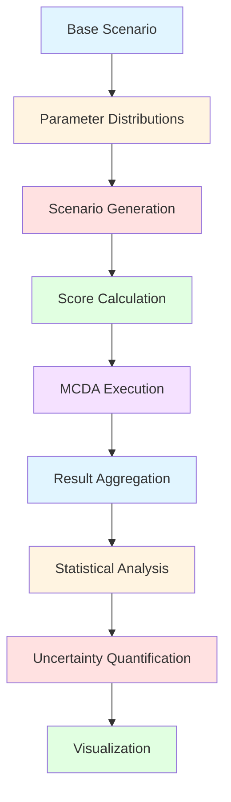

# Simulation Engine

This document provides a comprehensive technical overview of the simulation engine used in the SDG Decision Intelligence Framework, including scenario generation, sensitivity analysis, Monte Carlo methods, and uncertainty estimation.

---

## Table of Contents

1. [Simulation Overview](#simulation-overview)
2. [Scenario Generation](#scenario-generation)
3. [Monte Carlo Simulation](#monte-carlo-simulation)
4. [Sensitivity Analysis](#sensitivity-analysis)
5. [Leave-One-Out Analysis](#leave-one-out-analysis)
6. [Uncertainty Estimation](#uncertainty-estimation)
7. [Simulation Results](#simulation-results)
8. [Performance Optimization](#performance-optimization)

---

## Simulation Overview

### Purpose

The simulation engine quantifies uncertainty in initiative evaluation by exploring how scores and rankings vary under different parameter assumptions. It enables:

- **Risk Assessment**: Understand score variability and worst-case scenarios
- **Robustness Testing**: Identify initiatives stable under parameter changes
- **Decision Confidence**: Provide confidence intervals for scores and rankings
- **Scenario Planning**: Explore "what-if" scenarios for strategic planning

### Simulation Philosophy

1. **Probabilistic Modeling**: Treat uncertain parameters as probability distributions
2. **Exploratory Analysis**: Systematically explore parameter space
3. **Statistical Rigor**: Use established statistical methods for inference
4. **Transparent Assumptions**: Document all distributional assumptions
5. **Actionable Insights**: Translate uncertainty into decision guidance

### Simulation Workflow



---

## Scenario Generation

### Parameter Selection

The simulation engine perturbs the following parameters:

| Parameter | Base Value | Perturbation Range | Distribution |
|-----------|------------|-------------------|--------------|
| Budget | User-specified | ±15% | Uniform |
| Timeline | User-specified | ±20% | Uniform |
| Staff | User-specified | ±10% | Uniform |
| Risk Probability | User-specified | ±0.1 | Uniform |
| Synergy Coefficients | Research values | ±0.05 | Uniform |
| SDG Weights | Default/Custom | ±0.1 | Uniform |

### Distribution Assumptions

#### Uniform Distribution

**Rationale**: When no prior information exists, uniform distribution represents maximum uncertainty.

**Formula**:
```
X ~ Uniform(a, b)
f(x) = 1/(b-a) for a ≤ x ≤ b
```

**Application**: Budget, timeline, staff perturbations

#### Normal Distribution

**Rationale**: When parameter has central tendency with symmetric uncertainty.

**Formula**:
```
X ~ Normal(μ, σ²)
f(x) = (1/√(2πσ²)) × exp(-(x-μ)²/(2σ²))
```

**Application**: Risk probabilities (when sufficient data exists)

#### Triangular Distribution

**Rationale**: When parameter has most likely value with bounds.

**Formula**:
```
X ~ Triangular(a, b, c)
f(x) = 2(x-a)/((b-a)(c-a)) for a ≤ x ≤ c
f(x) = 2(b-x)/((b-a)(b-c)) for c ≤ x ≤ b
```

**Application**: Synergy coefficients (expert elicitation)

### Sampling Methods

#### Simple Random Sampling

**Algorithm**:
```typescript
function simpleRandomSampling(
  baseParams: InitiativeParams,
  n: number
): InitiativeParams[] {
  const scenarios: InitiativeParams[] = [];
  
  for (let i = 0; i < n; i++) {
    scenarios.push({
      budget: sampleUniform(
        baseParams.budget × 0.85,
        baseParams.budget × 1.15
      ),
      timeline: sampleUniform(
        baseParams.timeline × 0.8,
        baseParams.timeline × 1.2
      ),
      staff: sampleUniform(
        baseParams.staff × 0.9,
        baseParams.staff × 1.1
      ),
      // ... other parameters
    });
  }
  
  return scenarios;
}
```

**Complexity**: O(n) where n is number of scenarios

**Advantages**: Simple, unbiased
**Disadvantages**: May not efficiently explore extremes

#### Latin Hypercube Sampling

**Algorithm**:
```typescript
function latinHypercubeSampling(
  baseParams: InitiativeParams,
  n: number
): InitiativeParams[] {
  const scenarios: InitiativeParams[] = [];
  const dimensions = Object.keys(baseParams).length;
  
  // Generate stratified samples for each dimension
  const samples: number[][] = [];
  for (let d = 0; d < dimensions; d++) {
    const strata = Array.from({length: n}, (_, i) => i);
    shuffleArray(strata);
    
    const dimensionSamples = strata.map((stratum, i) => {
      const min = baseParams[dimensionKeys[d]] × (1 - perturbation[d]);
      const max = baseParams[dimensionKeys[d]] × (1 + perturbation[d]);
      const interval = (max - min) / n;
      return min + (stratum + Math.random()) × interval;
    });
    
    samples.push(dimensionSamples);
  }
  
  // Combine samples across dimensions
  for (let i = 0; i < n; i++) {
    const scenario: InitiativeParams = {};
    for (let d = 0; d < dimensions; d++) {
      scenario[dimensionKeys[d]] = samples[d][i];
    }
    scenarios.push(scenario);
  }
  
  return scenarios;
}
```

**Complexity**: O(n × d) where n is scenarios, d is dimensions

**Advantages**: Efficient space exploration, stratified coverage
**Disadvantages**: More complex implementation

**Reference**: McKay, M.D., et al. (1979). "A Comparison of Three Methods for Selecting Values of Input Variables in the Analysis of Output from a Computer Code". Technometrics.

---

## Monte Carlo Simulation

### Algorithm Overview

Monte Carlo simulation repeatedly samples parameter values from probability distributions, computes scores for each sample, and aggregates results to understand score distributions.

### Monte Carlo Process

```typescript
interface MonteCarloConfig {
  iterations: number;           // Number of scenarios (default: 1000)
  samplingMethod: 'simple' | 'lhs';  // Sampling method
  seed?: number;                // Random seed for reproducibility
  parallel?: boolean;           // Enable parallel processing
}

interface MonteCarloResults {
  scoreDistributions: {
    impact: number[];
    sustainability: number[];
    feasibility: number[];
    sdgAlignment: number[];
    overall: number[];
  };
  statistics: {
    mean: number;
    stdDev: number;
    percentile5: number;
    percentile25: number;
    percentile50: number;
    percentile75: number;
    percentile95: number;
  };
  rankingStability: Map<string, number>;  // Initiative ID → ranking frequency
}
```

### Implementation

```typescript
async function runMonteCarloSimulation(
  initiatives: Initiative[],
  config: MonteCarloConfig
): Promise<MonteCarloResults> {
  const {
    iterations = 1000,
    samplingMethod = 'lhs',
    seed = Date.now()
  } = config;
  
  // Set random seed for reproducibility
  setSeed(seed);
  
  const scoreDistributions = {
    impact: [] as number[],
    sustainability: [] as number[],
    feasibility: [] as number[],
    sdgAlignment: [] as number[],
    overall: [] as number[]
  };
  
  const rankingCounts = new Map<string, Map<number, number>>();
  
  // Run iterations
  for (let i = 0; i < iterations; i++) {
    // Generate scenario
    const scenarios = initiatives.map(init => 
      generateScenario(init, samplingMethod)
    );
    
    // Calculate scores
    const scores = scenarios.map(scenario => 
      calculateInitiativeScores(scenario)
    );
    
    // Run MCDA
    const mcdaResults = calculateMCDAScores(scenarios, 'consensus');
    
    // Record scores
    scores.forEach(s => {
      scoreDistributions.impact.push(s.impact);
      scoreDistributions.sustainability.push(s.sustainability);
      scoreDistributions.feasibility.push(s.feasibility);
      scoreDistributions.sdgAlignment.push(s.sdgAlignment);
      scoreDistributions.overall.push(s.overall);
    });
    
    // Record rankings
    const ranking = Array.from(mcdaResults.entries())
      .sort((a, b) => b[1] - a[1])
      .map(([id], rank) => ({id, rank}));
    
    ranking.forEach(({id, rank}) => {
      if (!rankingCounts.has(id)) {
        rankingCounts.set(id, new Map());
      }
      const count = rankingCounts.get(id)!.get(rank) || 0;
      rankingCounts.get(id)!.set(rank, count + 1);
    });
  }
  
  // Calculate statistics
  const statistics = calculateStatistics(scoreDistributions);
  
  // Calculate ranking stability
  const rankingStability = new Map<string, number>();
  rankingCounts.forEach((counts, id) => {
    const maxCount = Math.max(...Array.from(counts.values()));
    const total = Array.from(counts.values()).reduce((sum, c) => sum + c, 0);
    rankingStability.set(id, maxCount / total);
  });
  
  return {
    scoreDistributions,
    statistics,
    rankingStability
  };
}
```

### Statistical Calculations

```typescript
function calculateStatistics(distributions: ScoreDistributions) {
  const calcStats = (values: number[]) => {
    const sorted = [...values].sort((a, b) => a - b);
    const n = sorted.length;
    
    const mean = sorted.reduce((sum, v) => sum + v, 0) / n;
    const variance = sorted.reduce((sum, v) => sum + Math.pow(v - mean, 2), 0) / n;
    const stdDev = Math.sqrt(variance);
    
    const percentile = (p: number) => sorted[Math.floor(n × p / 100)];
    
    return {
      mean,
      stdDev,
      percentile5: percentile(5),
      percentile25: percentile(25),
      percentile50: percentile(50),
      percentile75: percentile(75),
      percentile95: percentile(95)
    };
  };
  
  return {
    impact: calcStats(distributions.impact),
    sustainability: calcStats(distributions.sustainability),
    feasibility: calcStats(distributions.feasibility),
    sdgAlignment: calcStats(distributions.sdgAlignment),
    overall: calcStats(distributions.overall)
  };
}
```

### Convergence Assessment

Monte Carlo simulation should run until results converge. Convergence is assessed using:

#### Standard Error

**Formula**:
```
SE = σ / √n
```

Where:
- `σ` = standard deviation
- `n` = number of iterations

**Stopping Criterion**: SE < 1.0 for all scores

#### Running Mean Stability

**Algorithm**:
```typescript
function checkConvergence(
  runningMeans: number[],
  window: number = 100,
  threshold: number = 0.5
): boolean {
  if (runningMeans.length < window) return false;
  
  const recent = runningMeans.slice(-window);
  const mean = recent.reduce((sum, v) => sum + v, 0) / recent.length;
  const variance = recent.reduce((sum, v) => sum + Math.pow(v - mean, 2), 0) / recent.length;
  const stdDev = Math.sqrt(variance);
  
  return stdDev < threshold;
}
```

### Complexity Analysis

| Operation | Complexity | Notes |
|-----------|------------|-------|
| Scenario Generation | O(n × d) | n = iterations, d = dimensions |
| Score Calculation | O(n × i) | i = initiatives |
| MCDA Execution | O(n × i × m) | m = MCDA methods |
| Statistics Calculation | O(n) | Single pass through results |
| Total | O(n × i × m) | Dominated by MCDA |

---

## Sensitivity Analysis

### Purpose

Sensitivity analysis identifies which parameters have the greatest influence on scores and rankings. It answers: "Which parameters matter most for this initiative?"

### Local Sensitivity Analysis

#### One-at-a-Time (OAT) Analysis

**Algorithm**:
```typescript
function oneAtATimeSensitivity(
  initiative: Initiative,
  parameters: string[],
  perturbation: number = 0.1
): SensitivityResults {
  const baseline = calculateInitiativeScores(initiative);
  const sensitivities: Map<string, number> = new Map();
  
  parameters.forEach(param => {
    const originalValue = initiative[param];
    
    // Perturb upward
    initiative[param] = originalValue × (1 + perturbation);
    const upScore = calculateInitiativeScores(initiative).overall;
    
    // Perturb downward
    initiative[param] = originalValue × (1 - perturbation);
    const downScore = calculateInitiativeScores(initiative).overall;
    
    // Restore original
    initiative[param] = originalValue;
    
    // Calculate sensitivity (partial derivative approximation)
    const sensitivity = (upScore - downScore) / (2 × perturbation × originalValue);
    sensitivities.set(param, sensitivity);
  });
  
  // Rank by sensitivity
  const ranked = Array.from(sensitivities.entries())
    .sort((a, b) => Math.abs(b[1]) - Math.abs(a[1]));
  
  return {
    sensitivities,
    ranked,
    baseline: baseline.overall
  };
}
```

**Output Example**:
```
Parameter          Sensitivity    Rank
Budget             0.45           1
Timeline           0.32           2
Risk Probability   0.18           3
Staff              0.12           4
```

**Interpretation**: Budget has the highest sensitivity—small changes in budget cause large changes in overall score.

### Global Sensitivity Analysis

#### Sobol' Indices

**Purpose**: Decompose output variance into contributions from input parameters.

**First-Order Index (Sᵢ)**:
```
Sᵢ = Var(E[Y|Xᵢ]) / Var(Y)
```

**Total-Order Index (Sᵀᵢ)**:
```
Sᵀᵢ = 1 - Var(E[Y|X₋ᵢ]) / Var(Y)
```

Where:
- `Y` = output score
- `Xᵢ` = input parameter i
- `X₋ᵢ` = all parameters except i

**Algorithm** (Saltelli sampling):
```typescript
function sobolSensitivity(
  initiative: Initiative,
  n: number = 1000
): SobolResults {
  const parameters = Object.keys(initiative);
  const k = parameters.length;
  
  // Generate two independent samples
  const A = generateSampleMatrix(n, k);
  const B = generateSampleMatrix(n, k);
  
  // Generate matrices for each parameter
  const C_i: number[][][] = [];
  for (let i = 0; i < k; i++) {
    const C = A.map((row, j) => {
      const newRow = [...row];
      newRow[i] = B[j][i];
      return newRow;
    });
    C_i.push(C);
  }
  
  // Calculate outputs
  const Y_A = A.map(row => evaluateModel(initiative, row));
  const Y_B = B.map(row => evaluateModel(initiative, row));
  const Y_C_i = C_i.map(C => C.map(row => evaluateModel(initiative, row)));
  
  // Calculate first-order indices
  const S_i: number[] = [];
  for (let i = 0; i < k; i++) {
    const numerator = Y_A.map((y, j) => y × Y_C_i[i][j]).reduce((sum, v) => sum + v, 0) / n;
    const f0_squared = Math.pow(Y_A.reduce((sum, y) => sum + y, 0) / n, 2);
    const variance = Y_A.map(y => Math.pow(y, 2)).reduce((sum, v) => sum + v, 0) / n - f0_squared;
    
    S_i.push((numerator - f0_squared) / variance);
  }
  
  // Calculate total-order indices
  const S_T_i: number[] = [];
  for (let i = 0; i < k; i++) {
    const numerator = Y_B.map((y, j) => y × Y_C_i[i][j]).reduce((sum, v) => sum + v, 0) / n;
    const f0_squared = Math.pow(Y_A.reduce((sum, y) => sum + y, 0) / n, 2);
    const variance = Y_A.map(y => Math.pow(y, 2)).reduce((sum, v) => sum + v, 0) / n - f0_squared;
    
    S_T_i.push(1 - (numerator - f0_squared) / variance);
  }
  
  return {
    firstOrder: parameters.map((p, i) => ({parameter: p, index: S_i[i]})),
    totalOrder: parameters.map((p, i) => ({parameter: p, index: S_T_i[i]}))
  };
}
```

**Reference**: Saltelli, A., et al. (2010). "Global Sensitivity Analysis: The Primer". Wiley-Blackwell.

### Weight Sensitivity Analysis

**Purpose**: Test how changes in scoring weights affect rankings.

**Algorithm**:
```typescript
function weightSensitivity(
  initiatives: Initiative[],
  weightVariation: number = 0.1
): WeightSensitivityResults {
  const baseWeights = {
    impact: 0.35,
    sustainability: 0.25,
    feasibility: 0.25,
    sdgAlignment: 0.15
  };
  
  const baseRanking = calculateMCDAScores(initiatives, 'consensus');
  const baseOrder = Array.from(baseRanking.entries())
    .sort((a, b) => b[1] - a[1])
    .map(([id]) => id);
  
  const results: WeightSensitivityResult[] = [];
  
  // Test each weight
  Object.keys(baseWeights).forEach(weightName => {
    // Increase weight
    const increasedWeights = {...baseWeights};
    const otherWeights = Object.keys(baseWeights).filter(w => w !== weightName);
    const adjustment = weightVariation / (otherWeights.length - 1);
    
    increasedWeights[weightName] = baseWeights[weightName] × (1 + weightVariation);
    otherWeights.forEach(w => {
      increasedWeights[w] = baseWeights[w] × (1 - adjustment);
    });
    
    const increasedRanking = calculateMCDAScores(initiatives, 'consensus', increasedWeights);
    const increasedOrder = Array.from(increasedRanking.entries())
      .sort((a, b) => b[1] - a[1])
      .map(([id]) => id);
    
    // Calculate ranking change (Spearman correlation)
    const spearman = calculateSpearmanCorrelation(baseOrder, increasedOrder);
    
    results.push({
      weight: weightName,
      variation: weightVariation,
      spearmanCorrelation: spearman,
      rankingChange: 1 - spearman
    });
  });
  
  return results.sort((a, b) => b.rankingChange - a.rankingChange);
}
```

**Interpretation**: High ranking change indicates ranking is sensitive to that weight.

---

## Leave-One-Out Analysis

### Purpose

Leave-one-out analysis tests how sensitive results are to the inclusion or exclusion of specific SDGs, risks, or dependencies. It answers: "Which SDGs/risks/dependencies are most critical?"

### SDG Leave-One-Out

**Algorithm**:
```typescript
function sdgLeaveOneOut(
  initiative: Initiative
): SDGLeaveOneOutResults {
  const baseScores = calculateInitiativeScores(initiative);
  const results: SDGLeaveOneOutResult[] = [];
  
  initiative.sdgIds.forEach(sdgId => {
    // Create initiative without this SDG
    const reducedInitiative = {
      ...initiative,
      sdgIds: initiative.sdgIds.filter(id => id !== sdgId)
    };
    
    // Calculate scores without this SDG
    const reducedScores = calculateInitiativeScores(reducedInitiative);
    
    // Calculate impact
    const impact = {
      impact: baseScores.impact - reducedScores.impact,
      sustainability: baseScores.sustainability - reducedScores.sustainability,
      feasibility: baseScores.feasibility - reducedScores.feasibility,
      sdgAlignment: baseScores.sdgAlignment - reducedScores.sdgAlignment,
      overall: baseScores.overall - reducedScores.overall
    };
    
    results.push({
      sdgId,
      impact,
      criticality: Math.abs(impact.overall)
    });
  });
  
  // Rank by criticality
  return results.sort((a, b) => b.criticality - a.criticality);
}
```

**Interpretation**: SDGs with highest criticality are most important to the initiative's score.

### Risk Leave-One-Out

**Algorithm**:
```typescript
function riskLeaveOneOut(
  initiative: Initiative
): RiskLeaveOneOutResults {
  const baseScores = calculateInitiativeScores(initiative);
  const results: RiskLeaveOneOutResult[] = [];
  
  initiative.risks.forEach((risk, index) => {
    // Create initiative without this risk
    const reducedInitiative = {
      ...initiative,
      risks: initiative.risks.filter((_, i) => i !== index)
    };
    
    // Calculate scores without this risk
    const reducedScores = calculateInitiativeScores(reducedInitiative);
    
    // Calculate impact
    const impact = {
      impact: baseScores.impact - reducedScores.impact,
      sustainability: baseScores.sustainability - reducedScores.sustainability,
      feasibility: baseScores.feasibility - reducedScores.feasibility,
      overall: baseScores.overall - reducedScores.overall
    };
    
    results.push({
      riskId: risk.id,
      risk,
      impact,
      criticality: Math.abs(impact.overall)
    });
  });
  
  // Rank by criticality
  return results.sort((a, b) => b.criticality - a.criticality);
}
```

**Interpretation**: Risks with highest criticality have the greatest impact on scores and should be prioritized for mitigation.

---

## Uncertainty Estimation

### Confidence Intervals

**Purpose**: Provide range of plausible values for scores.

**Formula** (95% CI using normal approximation):
```
CI = [mean - 1.96 × (σ/√n), mean + 1.96 × (σ/√n)]
```

Where:
- `mean` = sample mean
- `σ` = sample standard deviation
- `n` = sample size

**Algorithm**:
```typescript
function calculateConfidenceInterval(
  values: number[],
  confidence: number = 0.95
): {lower: number, upper: number} {
  const n = values.length;
  const mean = values.reduce((sum, v) => sum + v, 0) / n;
  const variance = values.reduce((sum, v) => sum + Math.pow(v - mean, 2), 0) / n;
  const stdDev = Math.sqrt(variance);
  
  const z = getZScore(confidence);  // 1.96 for 95% CI
  const margin = z × (stdDev / Math.sqrt(n));
  
  return {
    lower: mean - margin,
    upper: mean + margin
  };
}
```

### Prediction Intervals

**Purpose**: Provide range for future observations (accounts for both parameter uncertainty and model uncertainty).

**Formula**:
```
PI = [mean - 1.96 × σ × √(1 + 1/n), mean + 1.96 × σ × √(1 + 1/n)]
```

**Algorithm**:
```typescript
function calculatePredictionInterval(
  values: number[],
  confidence: number = 0.95
): {lower: number, upper: number} {
  const n = values.length;
  const mean = values.reduce((sum, v) => sum + v, 0) / n;
  const variance = values.reduce((sum, v) => sum + Math.pow(v - mean, 2), 0) / n;
  const stdDev = Math.sqrt(variance);
  
  const z = getZScore(confidence);
  const margin = z × stdDev × Math.sqrt(1 + 1/n);
  
  return {
    lower: mean - margin,
    upper: mean + margin
  };
}
```

### Bootstrap Confidence Intervals

**Purpose**: Non-parametric confidence intervals when distribution assumptions are uncertain.

**Algorithm**:
```typescript
function bootstrapConfidenceInterval(
  values: number[],
  iterations: number = 1000,
  confidence: number = 0.95
): {lower: number, upper: number} {
  const bootstrappedMeans: number[] = [];
  
  for (let i = 0; i < iterations; i++) {
    // Resample with replacement
    const sample = resampleWithReplacement(values);
    const mean = sample.reduce((sum, v) => sum + v, 0) / sample.length;
    bootstrappedMeans.push(mean);
  }
  
  // Calculate percentiles
  const sorted = bootstrappedMeans.sort((a, b) => a - b);
  const alpha = (1 - confidence) / 2;
  const lowerIndex = Math.floor(iterations × alpha);
  const upperIndex = Math.ceil(iterations × (1 - alpha));
  
  return {
    lower: sorted[lowerIndex],
    upper: sorted[upperIndex]
  };
}
```

**Reference**: Efron, B., & Tibshirani, R.J. (1993). "An Introduction to the Bootstrap". Chapman & Hall.

### Uncertainty Classification

**Classification Based on Standard Deviation**:

| StdDev Range | Classification | Interpretation |
|--------------|----------------|----------------|
| 0-5 | Low Uncertainty | High confidence in score |
| 5-10 | Medium Uncertainty | Moderate confidence |
| 10-20 | High Uncertainty | Low confidence |
| >20 | Very High Uncertainty | Very low confidence |

**Classification Based on Confidence Interval Width**:

| CI Width (as % of mean) | Classification | Interpretation |
|------------------------|----------------|----------------|
| 0-10% | Precise | High precision |
| 10-20% | Moderate Precision | Acceptable precision |
| 20-40% | Low Precision | Limited precision |
| >40% | Imprecise | Low precision |

---

## Simulation Results

### Result Structure

```typescript
interface SimulationResults {
  // Score distributions
  scoreDistributions: ScoreDistributions;
  
  // Statistical summaries
  statistics: StatisticalSummary;
  
  // Confidence intervals
  confidenceIntervals: ConfidenceIntervals;
  
  // Ranking stability
  rankingStability: RankingStability;
  
  // Sensitivity analysis
  sensitivity: SensitivityAnalysis;
  
  // Leave-one-out results
  leaveOneOut: LeaveOneOutResults;
  
  // Recommendations
  recommendations: SimulationRecommendations;
}
```

### Visualization

#### Score Distribution Plots

**Histogram**: Shows frequency distribution of scores
```typescript
function plotScoreHistogram(values: number[], bins: number = 20) {
  const min = Math.min(...values);
  const max = Math.max(...values);
  const binWidth = (max - min) / bins;
  
  const histogram = Array(bins).fill(0);
  values.forEach(v => {
    const binIndex = Math.min(Math.floor((v - min) / binWidth), bins - 1);
    histogram[binIndex]++;
  });
  
  return {
    bins: Array.from({length: bins}, (_, i) => min + i × binWidth),
    counts: histogram
  };
}
```

#### Box Plots

**Components**:
- Median (50th percentile)
- Q1 (25th percentile)
- Q3 (75th percentile)
- Whiskers (1.5 × IQR)
- Outliers (points beyond whiskers)

#### Tornado Diagrams

**Purpose**: Visualize sensitivity analysis results

**Algorithm**:
```typescript
function plotTornadoDiagram(sensitivities: SensitivityResult[]) {
  const maxSensitivity = Math.max(...sensitivities.map(s => Math.abs(s.sensitivity)));
  
  return sensitivities.map(s => ({
    parameter: s.parameter,
    sensitivity: s.sensitivity,
    barLength: Math.abs(s.sensitivity) / maxSensitivity,
    direction: s.sensitivity > 0 ? 'positive' : 'negative'
  }));
}
```

#### Spider Plots

**Purpose**: Compare multiple initiatives across multiple dimensions

**Algorithm**:
```typescript
function plotSpiderPlot(initiatives: Initiative[], scores: ScoreDistributions) {
  const dimensions = ['impact', 'sustainability', 'feasibility', 'sdgAlignment'];
  
  return initiatives.map(initiative => ({
    name: initiative.name,
    values: dimensions.map(dim => {
      const dist = scores[dim];
      return {
        dimension: dim,
        mean: dist.mean,
        ci: {lower: dist.percentile25, upper: dist.percentile75}
      };
    })
  }));
}
```

### Result Interpretation

#### High Uncertainty Indicators

1. **Wide Confidence Intervals**: Parameter estimates have high uncertainty
2. **Low Ranking Stability**: Rankings change frequently across scenarios
3. **High Sensitivity**: Scores sensitive to small parameter changes
4. **Skewed Distributions**: Non-normal distributions indicate non-linear effects

#### Low Uncertainty Indicators

1. **Narrow Confidence Intervals**: Precise parameter estimates
2. **High Ranking Stability**: Rankings consistent across scenarios
3. **Low Sensitivity**: Scores robust to parameter changes
4. **Normal Distributions**: Well-behaved, predictable outcomes

### Decision Guidance

**Proceed with Confidence**:
- All scores have low uncertainty (stdDev < 5)
- Ranking stability > 0.8
- Confidence intervals narrow (< 10% of mean)

**Proceed with Caution**:
- Some scores have medium uncertainty (stdDev 5-10)
- Ranking stability 0.5-0.8
- Confidence intervals moderate (10-20% of mean)

**Requires Further Analysis**:
- Any score has high uncertainty (stdDev > 10)
- Ranking stability < 0.5
- Confidence intervals wide (> 20% of mean)

**Do Not Proceed**:
- Multiple scores have very high uncertainty (stdDev > 20)
- Ranking stability < 0.3
- Confidence intervals very wide (> 40% of mean)

---

## Performance Optimization

### Parallel Processing

**Web Workers**: Offload simulation to background threads

```typescript
function runParallelSimulation(
  initiatives: Initiative[],
  config: MonteCarloConfig,
  workers: number = 4
): Promise<MonteCarloResults> {
  const iterationsPerWorker = Math.ceil(config.iterations / workers);
  const workerPromises: Promise<PartialResults>[] = [];
  
  for (let w = 0; w < workers; w++) {
    const workerPromise = new Promise<PartialResults>((resolve) => {
      const worker = new Worker('simulation-worker.js');
      
      worker.postMessage({
        initiatives,
        iterations: iterationsPerWorker,
        config
      });
      
      worker.onmessage = (e) => {
        resolve(e.data);
        worker.terminate();
      };
    });
    
    workerPromises.push(workerPromise);
  }
  
  // Combine results
  const partialResults = await Promise.all(workerPromises);
  return combineResults(partialResults);
}
```

### Memoization

**Cache expensive calculations**:

```typescript
const scoreCache = new Map<string, InitiativeScores>();

function calculateScoresWithCache(initiative: Initiative): InitiativeScores {
  const cacheKey = JSON.stringify(initiative);
  
  if (scoreCache.has(cacheKey)) {
    return scoreCache.get(cacheKey)!;
  }
  
  const scores = calculateInitiativeScores(initiative);
  scoreCache.set(cacheKey, scores);
  
  return scores;
}
```

### Adaptive Sampling

**Increase iterations only when needed**:

```typescript
function adaptiveMonteCarlo(
  initiative: Initiative,
  initialIterations: number = 100,
  maxIterations: number = 10000,
  targetStdDev: number = 1.0
): MonteCarloResults {
  let iterations = initialIterations;
  let results: MonteCarloResults;
  
  while (iterations <= maxIterations) {
    results = runMonteCarloSimulation([initiative], {iterations});
    
    const maxStdDev = Math.max(
      ...Object.values(results.statistics).map(s => s.stdDev)
    );
    
    if (maxStdDev < targetStdDev) {
      break;
    }
    
    iterations = Math.min(iterations × 2, maxIterations);
  }
  
  return results!;
}
```

---

## Limitations and Assumptions

### Limitations

1. **Distribution Assumptions**: Parameter distributions may not reflect true uncertainty
2. **Independence**: Assumes parameters are independent (may have correlations)
3. **Static Model**: Does not account for temporal dynamics or feedback loops
4. **Computational Cost**: Large numbers of iterations can be expensive
5. **Curse of Dimensionality**: Sensitivity analysis becomes expensive with many parameters

### Assumptions

1. **Parameter Ranges**: Perturbation ranges capture true uncertainty
2. **Score Linearity**: Scores respond linearly to parameter changes (may not hold)
3. **Stationarity**: Parameter distributions don't change over time
4. **Representative Sampling**: Sample scenarios represent true distribution
5. **Convergence**: Monte Carlo converges to true distribution

### Mitigation Strategies

1. **Expert Elicitation**: Use domain experts to validate distribution assumptions
2. **Correlation Modeling**: Include parameter correlations in sampling
3. **Dynamic Models**: Extend to include temporal dynamics
4. **Efficient Algorithms**: Use variance reduction techniques (antithetic variates, control variates)
5. **Dimensionality Reduction**: Use PCA or other methods to reduce parameter space

---

## Future Enhancements

### Planned Improvements

1. **Bayesian Calibration**: Use Bayesian methods to calibrate parameter distributions
2. **Agent-Based Simulation**: Model stakeholder interactions and feedback loops
3. **Time-Series Simulation**: Model score evolution over time
4. **Spatial Simulation**: Incorporate geographic and spatial effects
5. **Machine Learning**: Use ML to learn parameter distributions from data

### Research Directions

1. **Variance Reduction**: Implement advanced variance reduction techniques
2. **Multi-Fidelity Models**: Combine high-fidelity and low-fidelity models
3. **Sequential Monte Carlo**: Implement particle filtering for dynamic systems
4. **Gaussian Process Emulators**: Use GPs as surrogate models for expensive simulations
5. **Causal Inference**: Incorporate causal modeling for scenario analysis

---

## Conclusion

The simulation engine provides a rigorous framework for quantifying uncertainty in SDG initiative evaluation. By combining Monte Carlo methods, sensitivity analysis, and uncertainty estimation, the framework enables:

- **Risk-Aware Decision-Making**: Understand score variability and worst-case scenarios
- **Robustness Testing**: Identify initiatives stable under uncertainty
- **Confidence Assessment**: Provide statistical confidence in recommendations
- **Scenario Exploration**: Systematically explore "what-if" scenarios

This analytical approach transforms initiative evaluation from deterministic assessment into probabilistic decision-making grounded in statistical rigor and uncertainty quantification.
